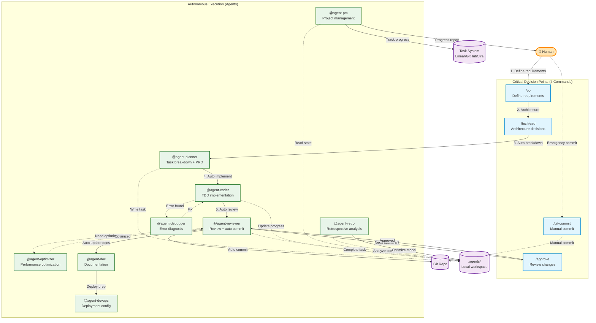
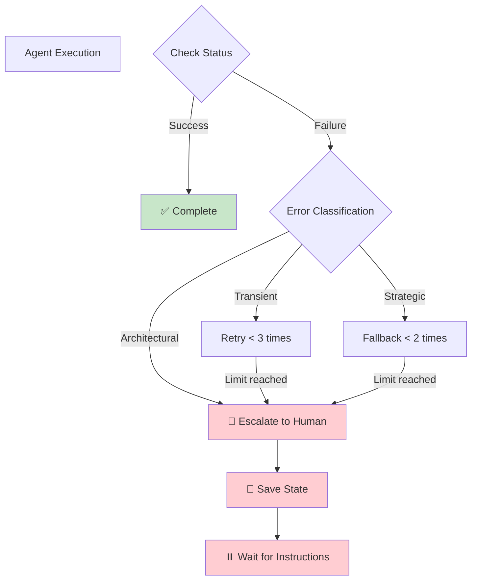

# Agent-First Programming Workflow

## Overview

This document defines the **Agent-First** human-agent collaborative development workflow based on Claude Code. The core principle: **Agents handle complex automation**, **Commands are used only at critical decision points**, ensuring efficiency, quality, and traceability.

## Core Principles

1. **Agent-First**: Agents autonomously execute complex tasks, humans focus on critical decisions
2. **Simplified Structure**: Minimalist local workspace, easy to maintain and clean
3. **Standard Communication**: Standardized data exchange via JSON + Markdown
4. **Fibonacci Complexity**: Complexity estimation based on token consumption, not human hours
5. **Continuous Improvement**: Retro Agent analyzes estimation accuracy and optimizes future predictions

## Workflow Architecture



## Agent Local Workspace

### Quick Start

```bash
# Initialize workspace
/init-agents

# Detailed guide
See: commands/init-agents.md
```

### Workspace Structure Overview

```
.agents/
├── tasks/          # Task state (JSON + markdown)
├── retro/          # Retrospective analysis
├── states.yml      # State definitions
├── lib.js          # Helper library
└── README.md       # Usage guide
```

**Detailed Technical Guide**: See @~/.claude/agent-workspace-guide.md

### Core Concepts

- **Fibonacci Complexity**: 1, 2, 3, 5, 8, 13... (1 point = 1000 tokens)
- **State Management**: states.yml is the single source of truth
- **Auto Cleanup**: Based on file mtime, deleted after 90 days
- **Agent Communication**: JSON task state + Markdown detailed content

## Commands Layer (Critical Decision Points)

### 1. `/po` - Product Requirements Definition
**When to use**: Project start or new feature planning
**You decide**: Core feature scope, acceptance criteria, priorities
**Then auto**: `@agent-planner` automatically breaks down tasks

### 2. `/techlead` - Technical Architecture Decisions
**When to use**: Major technology selection or architecture changes
**You decide**: Tech stack, architecture patterns, risk assessment
**Then auto**: `@agent-planner` refines tasks based on architecture

### 3. `/approve` - Review Important Changes
**When to use**: API changes, schema changes, major refactoring
**You decide**: Approve or request modifications
**Then auto**: `@agent-reviewer` completes commit

### 4. `/git-commit` - Manual Git Commit
**When to use**: Emergency fixes or special commits
**You decide**: Commit timing and message

### 5. `/init-agents` - Initialize Agent Workspace
**When to use**: New project start
**Execution**: Create `.agents/` structure, state definitions, helper library

## Agents Layer (Autonomous Execution)

### Core Agents

| Agent | Responsibility | Input | Output | Handoff To |
|-------|---------------|-------|--------|-----------|
| `@agent-planner` | Task breakdown, PRD generation | Requirements | planner.md | @agent-coder |
| `@agent-coder` | TDD implementation | PRD | coder.md | @agent-reviewer |
| `@agent-reviewer` | Quality review + **Git commit** | Code | reviewer.md | **@agent-pm** |
| `@agent-pm` | **Completion workflow**: Retro + Report | Commit info | Completion report | User |
| `@agent-retro` | Retrospective analysis | Completed task | Estimation insights | @agent-pm |
| `@agent-debugger` | Error diagnosis & fix | Error info | debugger.md | @agent-coder |
| `@agent-optimizer` | Performance optimization | Code | optimizer.md | @agent-reviewer |
| `@agent-doc` | Documentation generation | Code | Documentation | @agent-reviewer |
| `@agent-devops` | Deployment configuration | Application | Deploy config | User |

### Agent Operation Example

```javascript
const { AgentTask } = require('./.agents/lib');

// Planner: 建立任務
const task = AgentTask.create('LIN-123', 'Implement auth API', 8);
task.writeAgentOutput('planner', '# PRD...');
task.updateAgent('planner', { status: 'completed', handoff_to: 'coder' });

// Coder: 接手任務
const myTasks = AgentTask.findMyTasks('coder');
task.updateAgent('coder', { status: 'working' });

// Reviewer: 審查並 commit
task.updateAgent('reviewer', { status: 'completed', handoff_to: 'pm' });

// PM: 任務完成流程
// 1. 觸發 retro
// 2. 生成報告
// 3. 更新 Linear
// 4. 回報用戶

// Reviewer: 完成任務
task.complete();  // 自動計算實際複雜度
```

**Complete API Documentation**: See [agent-workspace-guide.md](./agent-workspace-guide.md#agent-工作流程範例)

## Workflow Examples

### Example 1: Standard Development Flow (with Task Completion)

```bash
# Step 1: Define requirements (human)
/po "實作用戶認證系統"

# Step 2: Architecture decisions (human)
/techlead [選擇 JWT + PostgreSQL]

# Step 3-N: Fully automated
# @agent-planner breaks down tasks (LIN-123) →
# @agent-coder implements →
# @agent-reviewer reviews + commits →
# @agent-pm receives handoff:
#   1. Triggers @agent-retro analyze LIN-123
#   2. Generates completion report
#   3. Updates Linear issue to Done
#   4. Reports to user with retro insights
```

### Example 2: Requires Human Review

```bash
# Agents execute automatically
@agent-coder "修改 User API schema"

# System prompt: Important changes need review
/approve [檢視變更]

# Auto commit after approval
```

### Example 3: Error Diagnosis

```bash
# Fully automated
@agent-debugger "修復登入 500 錯誤"
# → @agent-coder auto fixes
# → @agent-reviewer reviews + commits
```

### Example 4: Task Completion Workflow (Automatic)

```bash
# After @agent-reviewer commits code:
#
# @agent-reviewer → handoff to @agent-pm
#
# @agent-pm automatically:
# 1. Calls @agent-retro analyze LIN-123
#    Output:
#    - Estimation accuracy: 78%
#    - Actual complexity: 10 (estimated 8)
#    - Token usage: 8500 (estimated 8000)
#    - Lessons: Authentication logic more complex than expected
#
# 2. Generates completion report for user:
#    ✅ Task LIN-123 completed
#    📊 Retro: 78% estimation accuracy
#    💡 Insight: Add 20% buffer for auth tasks
#    🔗 Linear updated to Done
#
# 3. Waits for user acknowledgment
# - Recommendation: Add +2 complexity for Auth tasks
```

## Agent Failure Protection

### Auto Escalation Flow



### Escalation Triggers

- ❌ 同一錯誤重試 ≥ 3 次
- ⏱️ 執行時間超過預期 3 倍
- 💾 資源使用異常 (Memory >80%, CPU >90%)
- 🚨 架構/安全問題立即升級

### Escalation Notification Format

```markdown
🚨 **Agent 需要人工協助**

**Agent**: @agent-coder
**任務**: LIN-123
**狀態**: ⏸️ 暫停

**問題**: 測試失敗已重試 3 次

**當前狀態**:
- ✅ 已保存: stash@{0}
- ✅ 診斷: .agents/tasks/LIN-123/coder.md
- ✅ 任務標記: BLOCKED

**選項**:
A) 查看失敗原因
B) 直接接手修復
C) 調整需求
```

## Data Cleanup Mechanism

### Auto Cleanup (File mtime-based)

```javascript
// 清理 90 天前完成的任務
const { AgentTask } = require('./.agents/lib');

const cleaned = AgentTask.cleanup(90);
console.log(`Cleaned ${cleaned} old tasks`);

// 定期執行 (cron)
// 0 2 * * * cd /path/to/project && node -e "require('./.agents/lib').AgentTask.cleanup(90)"
```

### Cleanup Rules

- ✅ 只清理 `completed` 或 `cancelled` 狀態
- ✅ 基於檔案 `mtime` 判斷年齡
- ✅ 同時刪除 JSON 和對應資料夾
- ✅ 無需 archive 資料夾

## Git Version Control

### Commit Authority Control

**✅ 有 Commit 權限**:
1. `@agent-reviewer` - 審查通過後自動 commit
2. `/git-commit` - Human 手動 commit

**❌ 無 Commit 權限**:
- `@agent-coder`
- `@agent-planner`
- 其他所有 agents

### Commit Format

```bash
# Conventional Commits
<type>[optional scope]: <description>

# 範例
feat(LIN-123): implement JWT token service
fix(LIN-124): resolve login timeout issue
docs: update API documentation

# 自動添加
🤖 Generated with [Claude Code](https://claude.com/claude-code)

Co-Authored-By: Claude <noreply@anthropic.com>
```

## Best Practices

### 1. Agent-First Priority

- ✅ 複雜任務 → 使用 Agents
- ✅ 自動化工作 → 使用 Agents
- ⚠️ 關鍵決策 → 使用 Commands

### 2. Task Complexity Estimation

- 基於 token 消耗,非人類工時
- 使用費氏數列: 1, 2, 3, 5, 8, 13...
- 由 `@agent-retro` 持續優化

### 3. Keep Workspace Clean

```bash
# 定期清理
AgentTask.cleanup(90);

# 檢查工作區大小
du -sh .agents/

# 查看活躍任務
ls .agents/tasks/*.json | wc -l
```

### 4. Monitor Agent Status

```bash
# 查看任務狀態
cat .agents/tasks/LIN-123.json | jq

# 查看 Agent 輸出
cat .agents/tasks/LIN-123/coder.md

# 查看回顧分析
cat .agents/retro/*.md
```

## Workflow Improvement Log

### ✅ Completed

- [x] 簡化為 4 個關鍵 Commands
- [x] Agent 處理所有複雜工作
- [x] 極簡本地工作區架構
- [x] 費氏複雜度估算機制
- [x] Retro Agent 回顧分析
- [x] 基於檔案時間的自動清理
- [x] 狀態定義檔 (states.yml)
- [x] Agent 輔助函式庫 (lib.js)
- [x] `/init-agents` 初始化 command

### 📋 To Implement

- [ ] 實作 `@agent-planner`
- [ ] 實作 `@agent-doc`
- [ ] 實作 `@agent-devops`
- [ ] 實作 `@agent-retro`
- [ ] 實作 `/approve` command
- [ ] 更新所有 Agent 使用新工作區
- [ ] 建立使用範例專案
- [ ] 收集使用反饋並優化

## References

- @~/.claude/CLAUDE.md - 全局配置
- @~/.claude/commands/ - Commands 定義
- @~/.claude/agents/ - Agents 規格
- @~/.claude/agent-workspace-guide.md - 工作區詳細指南
- @~/.claude/commands/init-agents.md - 初始化指令

---

**Last Updated**: 2025-10-02
**Version**: 2.0 - Agent-First
**Status**: Active Development
