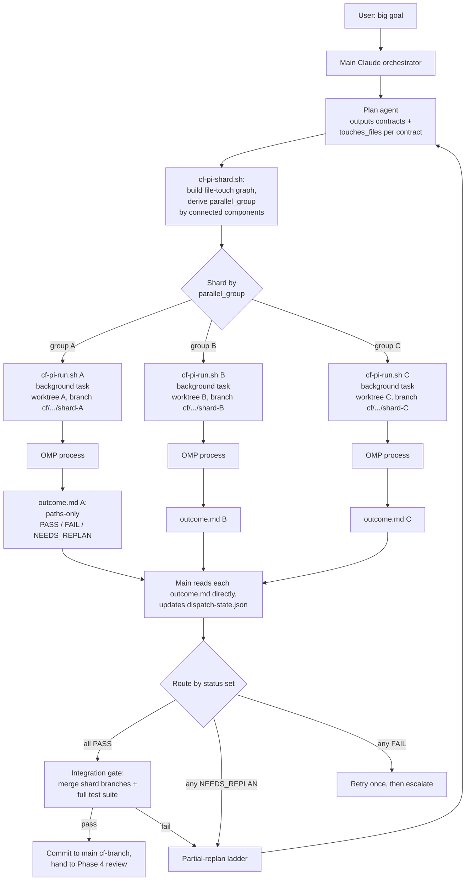
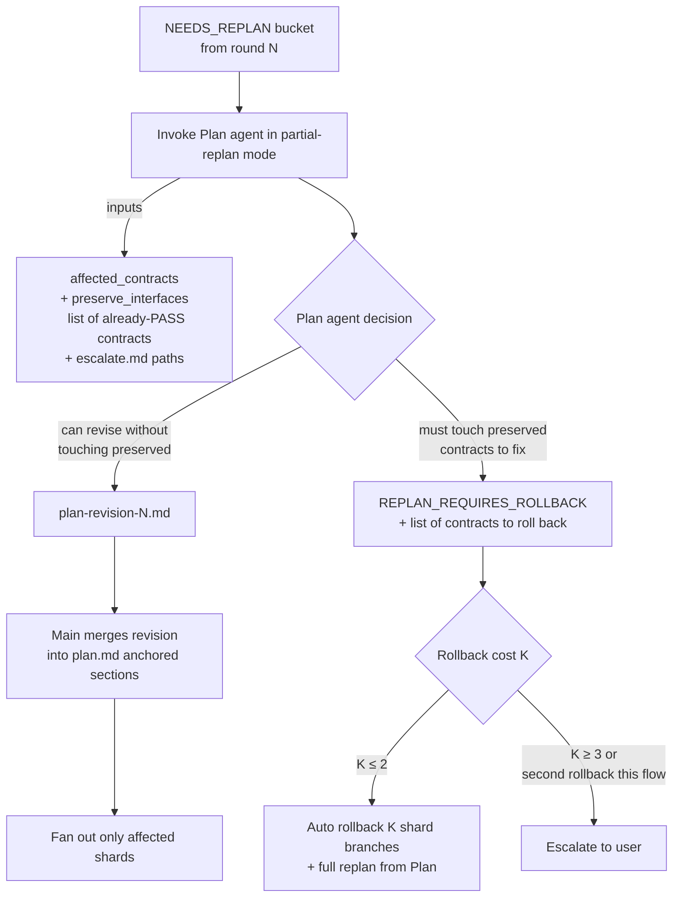

# Parallel Sharded OMP — Design

Status: draft (architecture proposal, not yet implemented)
Scope: context-flow Phase 3 (Implement) overhaul + Plan phase additions
Author intent: let `cf` run a large goal to completion inside a single main-context budget by fanning out OMP work in parallel as main-launched background tasks, reading each shard's paths-only outcome directly, and routing structured escalations without bouncing through the user.

---

## 1. Goals & Non-Goals

### Goals
- **Token budget**: minimize main-orchestrator token spend so a medium goal (5–10 contracts, 2–3 replan cycles) finishes well under the compaction threshold.
- **Parallelism**: dispatch multiple OMP processes concurrently at the finest meaningful granularity (per parallel group of contracts).
- **Recoverability**: agent or OMP failures must never invalidate already-completed contract work.
- **Adaptive escalation**: OMP can signal "spec is wrong, not my bug" and the system replans only the affected slice without nuking validated work.
- **Single flow**: no branch between "single OMP" and "sharded OMP". Sharding with N=1 IS the single-worker case.

### Non-Goals
- Replacing the Claude implement agent fallback (it remains for non-OMP environments).
- Cross-OMP real-time coordination (sub-agents cannot talk to each other while running; coordination happens at fan-out boundaries).
- Eliminating human review at the end of the flow.

---

## 2. Architecture Overview



### Layer responsibilities

| Layer | Owns | Token cost source |
|---|---|---|
| Main orchestrator | Goal interpretation, shard fan-out decisions, reading each shard's paths-only `outcome.md`, outcome routing, integration gate, user-facing summary | Initial goal + per-shard `outcome.md` reads + integration + final summary |
| `cf-pi-run.sh` (per shard, main-launched **background task**) | Full OMP lifecycle: worktree → brief → probe → dispatch → poll → gates → outcome write. No sub-agent. Heavy stdout goes to the task's own output file; main reads only the resulting `outcome.md` | Zero Claude tokens (background task; main reads only `outcome.md`) |
| OMP | Implement contracts, per-contract commit, write `$REPORT_FILE` or `$ESCALATE_FILE` | Zero Claude tokens (separate billing) |

---

## 3. Sharding Model

Sharding is derived from a **file-touch graph**, not declared by Plan. This prevents two shards from independently editing the same file (a class of conflict integration-gate merge cannot resolve).

### Plan agent output contract (extended)

Plan emits **two paired artifacts**:

1. `plan.md` — human-readable rationale + design narrative (unchanged role; for human/review consumption)
2. `contracts.json` — **machine-readable sidecar**, the single source of truth for orchestration scripts

Downstream scripts (`cf-pi-shard.sh`, `cf-pi-brief.sh`, `cf-pi-merge-revision.sh`) read only `contracts.json`. They never parse `plan.md`. This eliminates the brittle markdown-parsing-in-shell contract.

### `contracts.json` schema

```json
{
  "schema_version": 1,
  "flow_id": "cf-2026-05-24-foo",
  "contracts": [
    {
      "name": "UserAuth.LoginFlow",
      "summary": "User can log in via email+password and receive a session token",
      "touches_files": [
        "src/auth/middleware.ts",
        "src/auth/session.ts",
        "test/auth/login.test.ts"
      ],
      "test_cases": [
        {"id": "T1", "given": "valid credentials", "expect": "200 + token"},
        {"id": "T2", "given": "wrong password", "expect": "401"}
      ],
      "attachments": [
        {"name": "design-rationale", "path": "plan-attachments/login-flow-rationale.md"}
      ]
    },
    {
      "name": "UserAuth.TokenRefresh",
      "touches_files": ["src/auth/middleware.ts", "src/auth/token.ts", "test/auth/token.test.ts"],
      "test_cases": [...],
      "attachments": []
    }
  ]
}
```

Field rules:
- `name`: stable identifier (used as anchor in plan.md, key for partial-replan, branch label hint).
- `touches_files`: superset of every file the contract creates or modifies (test files count). Underset is a bug; `cf-pi-run.sh` post-validates `actual ⊆ declared` and NEEDS_REPLANs on violation.
- `test_cases`: structured test intent, drives grep-guard generation in shell (no markdown parsing).
- `attachments`: **escape hatch for prose**. When a contract genuinely needs rich design discussion / decision log / diagrams, Plan attaches a markdown file under `plan-attachments/`. Brief assembly includes attachment contents verbatim for OMP to read. Empty array is the common case.

### Group derivation (script, not Plan)

`scripts/cf-pi-shard.sh` consumes `contracts.json` only:

```
nodes = contracts[].name
edge(A, B) ⇔ A.touches_files ∩ B.touches_files ≠ ∅
parallel_group(C) = component_id of C
```

Output: `$SESSION/shards.json`:

```json
{
  "groups": {
    "g1": {"contracts": ["UserAuth.LoginFlow", "UserAuth.TokenRefresh"], "files": ["src/auth/middleware.ts", ...]},
    "g2": {"contracts": ["BillingDashboard.UsageWidget"], "files": ["src/billing/widget.tsx", ...]}
  },
  "fan_out_count": 2
}
```

Same-file ⇒ same group, deterministically. Physical merge conflicts at integration become structurally impossible (semantic regressions are still possible — integration gate is their safety net).

If `fan_out_count == 1`, the single-worker case is identical in code path — just one background `cf-pi-run.sh` task.

---

## 4. Shard Isolation & Recoverability

Each shard runs in its own git worktree on its own branch. No two OMP processes ever touch the same checkout. Combined with §3's file-graph sharding, **two shards cannot edit the same file** — integration-time merges are conflict-free by construction (semantic regressions excepted; integration gate catches those).

| Resource | Naming | Lifetime |
|---|---|---|
| Worktree | `.claude/worktrees/cf-<flow>-shard-<id>/` | Removed after integration succeeds |
| Branch | `cf/<flow>/shard-<id>` | Kept until flow finalized; deletion deferred |
| Checkpoint tag | `cf-checkpoint/<flow>/shard-<id>@<sha>` | Created on PASS; survives flow cleanup |
| Session dir | `$SESSION/shards/<id>/` | Holds brief, report, escalate, outcome, postmortem per shard |

### Recoverability ladder

1. **Per-contract commit (existing OMP protocol §3.6)**: failed contracts inside a shard leave no commit. PARTIAL shard's branch already represents only validated work.
2. **Per-shard branch**: one shard's collapse never affects another's commits.
3. **Checkpoint tag**: each PASS shard gets a tag — surgical rollback target.
4. **Integration gate**: merge into a transient `cf/<flow-slug>-integrated` branch (sibling naming — a `/integrated` suffix would collide with the shard branch refs) and run the full test suite. The main cf-branch is only touched after integration passes — failures never corrupt the trunk.

### Worst case
Entire flow aborts; all shard branches and checkpoint tags remain. User can cherry-pick validated contract commits manually.

---

## 5. OMP Brief — Environment Block

`cf-pi-brief.sh` is extended to inject an `## Environment` block before contracts. This is the only window OMP has into the worktree/branch context.

```markdown
## Environment
- WORK_DIR: /abs/path/to/.claude/worktrees/cf-<flow>-shard-<id>
- CF_BRANCH: cf/<flow>/shard-<id>          ← you are already on this branch
- BASE_HEAD: <sha>                          ← compute diffs against this
- REPORT_FILE: /abs/path/to/implement-report.md
- ESCALATE_FILE: /abs/path/to/escalate.md   ← write here when stuck
- TEST_RUNNER: <test command>
- SHARD_GROUP: <parallel_group id>

## Rules
- All file writes MUST stay inside WORK_DIR; never cd out
- Forbidden: git push, git remote operations, modifying other branches
- Per-contract commit to CF_BRANCH (see Methodology §3.6)
- If a referenced file is missing, consult Implementation Plan path — do not invent locations
```

---

## 6. OMP Escalation Contract

Added to `pi-implementer-protocol.md`. OMP triggers escalation by writing `$ESCALATE_FILE` then printing `DONE`.

### When to escalate (OMP-side rules)

- A contract is internally inconsistent, contradicts another contract, or is infeasible as specified.
- A required file/module from the Implementation Plan does not exist and creating it would change the architectural shape.
- A required dependency is missing and cannot be installed safely.
- The same test failure pattern recurs across two distinct fix attempts.

### Escalation file schema

```markdown
## Blocker
{one-line summary}

## Affected contracts
- {ContractName}
- ...

## What I tried
- {bullet}
- ...

## What I need from Plan/Research
{specific question or concrete unblock action}
```

`$ESCALATE_FILE` presence after OMP exit ⇒ `cf-pi-run.sh` sets outcome status `NEEDS_REPLAN` regardless of whether `$REPORT_FILE` also exists. Any contract commits OMP made before escalation are preserved on the shard branch.

---

## 7. Outcome Status & Routing

Three statuses (collapsed from four — PARTIAL's routing was identical to NEEDS_REPLAN-with-affected-list, so it was folded in):

| Status | Trigger | Main routing |
|---|---|---|
| `PASS` | All contracts in shard survive gate 1 + gate 3 + file-scope check | Tag checkpoint, mark shard done |
| `FAIL` | OMP infrastructure failure (probe error, stall after retry, dispatch broken, report missing) | Retry brief once; second FAIL ⇒ escalate to user |
| `NEEDS_REPLAN` | Any of: `$ESCALATE_FILE` present; persistent test failure after one in-shard redispatch; an undeclared file was touched | Coalesce all NEEDS_REPLAN this round; accept any passed contracts; invoke Plan partial-replan for `affected_contracts` |

`NEEDS_REPLAN` always carries:
- `passed_contracts`: contracts that did survive (already committed on shard branch — preserved)
- `affected_contracts`: contracts that need a spec revision
- `reason`: enum + escalate.md path (when worker-initiated) OR gate failure summary

### Round-collection rule

Main waits for **all** shards in a fan-out round to return before routing. This:
- Lets NEEDS_REPLAN coalesce (one Plan invocation handles all blocked contracts at once).
- Avoids interleaved replans that could conflict.

---

## 8. NEEDS_REPLAN Safety Ladder

The user's hard requirement: never silently waste validated work. Partial-replan is the default, but Plan agent owns the decision to escalate.



### Plan agent contract changes

New invocation mode:

```
Plan(
  mode = "partial-replan",
  affected_contracts = [...],
  preserve_interfaces = [contract names whose external shape is now load-bearing],
  escalations = [paths to escalate.md files],
  base_contracts = path to current contracts.json,
  base_plan_md = path to current plan.md   # for prose context only
)
```

Two possible outputs:

1. `contracts-revision-<n>.json` — partial document with only the rewritten contract entries (matching the same schema as `contracts.json`). `scripts/cf-pi-merge-revision.sh` applies it to `contracts.json` via `jq` (replace-by-name semantics). Plan also updates `plan.md` prose for affected contract sections; that update is delivered as a sub-agent return note for main to apply via the same merge script if anchor exists, or skip silently if narrative drift is acceptable.
2. `replan-status.json` with `{status: "REPLAN_REQUIRES_ROLLBACK", rollback_contracts: [...], rationale: "..."}` — Plan declines partial-replan because the fix demands changing preserved interfaces.

Critically: `contracts.json` is the load-bearing artifact for orchestration. `plan.md` prose drift is tolerable; `contracts.json` drift is not. `cf-pi-merge-revision.sh` validates schema_version and refuses to merge on mismatch.

### Integration gate failure path

Per decision (2a), integration gate failure auto-injects a NEEDS_REPLAN for contracts whose tests failed in the merged checkout. This funnels through the same ladder above. The first replan cycle catches simple drifts; recurring integration failures hit the rollback branch.

---

## 9. State Tracking

Main keeps state on disk, not in context.

File: `$SESSION/dispatch-state.json`

```json
{
  "flow_id": "cf-2026-05-24-foo",
  "rounds": [
    {
      "round": 1,
      "shards": ["A", "B", "C"],
      "results": {"A": "PASS", "B": "NEEDS_REPLAN", "C": "NEEDS_REPLAN"},
      "checkpoints": {"A": "cf-checkpoint/foo/shard-A@abc123"},
      "affected_contracts": ["UserAuth.TokenRefresh", "Billing.Widget"]
    }
  ],
  "replan_count": {"contract.X": 1, "contract.Y": 2},
  "rollback_count": 0,
  "preserved_contracts": ["UserAuth.LoginFlow", "UserAuth.TokenRefresh"]
}
```

Main reads/writes this between rounds via Bash; never holds the JSON in context.

---

## 10. Limits & Escalation to User

| Limit | Threshold | Action |
|---|---|---|
| Per-contract replan attempts | 2 | Third NEEDS_REPLAN for the same contract ⇒ escalate to user |
| Per-flow rollback cycles | 2 | Third rollback ⇒ escalate to user |
| FAIL retries (per shard, per round) | 1 | Second consecutive FAIL ⇒ re-launch `cf-pi-run.sh` once; second FAIL ⇒ escalate to user |

---

## 11. Outcome Contract (`outcome.md`, main reads directly)

There is no distillation sub-agent. `cf-pi-run.sh` writes a **paths-only** `outcome.md` at `$SESSION/shards/<id>/outcome.md`; main reads it directly. Every value is either a short enum/identifier or a filesystem path — never inlined report/log/diff content — so the read is bounded by construction.

```markdown
## Status
{PASS|FAIL|NEEDS_REPLAN}

## Reason
{enum string, e.g. none | escalate | test-fail-persistent | undeclared_file_touched | stall | timeout | ...}

## Run
- shard: {SHARD_ID}
- elapsed: {Xs}
- report: {path|-}
- diff: {path|-}
- session_jsonl: {path|-}
- escalate: {path|-}

## Survived contracts
- {ContractName}
- ...

## Affected contracts
- {ContractName}: {one-line reason, gate# or "escalate"}

## Artifacts
- postmortem: {path|-}
- test_log: {path|-}
- undeclared_files: {csv|-}
```

Main parses Status + Reason + Survived/Affected contracts deterministically. There is no narrative `## Notes` section and no word cap: any deeper context lives on disk behind the paths in `## Run` / `## Artifacts`, which main pulls (bounded) only when a routing decision needs it.

---

## 12. File-by-file Change Inventory

### New
- `scripts/cf-pi-run.sh` — full Phase 3 lifecycle for ONE shard in shell, run by main as a **background task** (no sub-agent): worktree, brief, probe, dispatch, poll loop, gates 1/3, escalate detection, `actual_touched ⊆ declared` post-validation, paths-only `outcome.md` write. Runs to completion synchronously, so as a background task it is exempt from the foreground Bash ceiling; its heavy stdout is captured to the task's own output file, never main's context.
- `scripts/cf-pi-shard.sh` — read `contracts.json`, build file-touch graph via `jq`, emit `shards.json` with connected-component group assignments. **No markdown parsing.**
- `scripts/cf-pi-integrate.sh` — merge all shard branches into `cf/<flow>/integrated`, run full test suite, classify result.
- `scripts/cf-pi-rollback.sh` — rollback a list of shard branches; preserve their checkpoint tags.
- `scripts/cf-pi-merge-revision.sh` — apply `contracts-revision-<n>.json` to `contracts.json` via `jq` (replace-by-name; schema_version validated). Pure shell; never enters main context.
- `scripts/cf-pi-status.sh` — operator-facing read-only liveness view across all shards; reads each worktree's JSONL mtime/elapsed and prints a one-line-per-shard summary. (Added for mid-run observability — see §18.)
- `docs/parallel-sharded-design.md` — this file.

### Deleted
- `agents/pi-driver.md` — the per-shard distillation sub-agent is gone. Phase 3 now launches `cf-pi-run.sh` directly as a main-launched background task and reads each shard's paths-only `outcome.md` itself (§2, §11). The §17 token firewall it used to enforce is now enforced by the background-task output split.

### Modified
- `agents/plan.md` — emits paired `plan.md` (prose) + `contracts.json` (structured). New partial-replan mode outputs `contracts-revision-<n>.json` OR `replan-status.json` with REPLAN_REQUIRES_ROLLBACK. `parallel_group` is script-derived, not Plan-declared.
- `docs/pi-implementer-protocol.md` — adds escalation contract (§6 here), ENVIRONMENT block expectation.
- `scripts/cf-pi-brief.sh` — consumes `contracts.json` (not plan.md) for contract data; emits `## Environment` block; expands `attachments` paths into brief.
- `scripts/cf-pi-env.sh` — derives per-shard paths (WORK, BRIEF_FILE, REPORT_FILE, ESCALATE_FILE, OUTCOME_FILE) under `$SESSION/shards/<id>/`.
- `commands/cf.md` — Phase 3 section rewritten: shard → fan-out → collect → route → integrate.

### Retained as-is
- Existing `cf-pi-probe.sh`, `cf-pi-dispatch.sh`, `cf-pi-poll.sh`, `cf-pi-stop.sh`, `cf-pi-postmortem.sh`, `cf-pi-test.sh` — used internally by `cf-pi-run.sh`.

---

## 13. Token Budget Sketch (medium goal)

Realistic estimate accounts for integration-gate failures auto-triggering NEEDS_REPLAN (decision 2a), which typically adds 1–2 extra replan cycles on top of worker-initiated escalations.

| Phase | Source | Happy path | Typical (2–3 replan cycles) |
|---|---|---|---|
| Phase 1 research | Research sub-agent return | ~3K | ~3K |
| Phase 2 plan | Plan sub-agent return + main reads anchors | ~5K | ~5K |
| Phase 3 fan-out, round 1 | main reads 5 shards' paths-only `outcome.md` | ~3K | ~3K |
| Phase 3 replan cycles | Plan partial-replan return + re-fan-out per cycle (~5K each) | ~6K (1 cycle) | ~15K (3 cycles) |
| Phase 3 integration | Integration script summary | ~1K | ~3K (multiple attempts) |
| Phase 4 review | Review sub-agent return | ~5K | ~5K |
| Final user-facing summary | — | ~2K | ~2K |
| **Total** | | **~25K** | **~40–60K** |

Both well under compaction threshold for a 200K-context model. The 40–60K typical case still leaves headroom for unusually deep escalations. If a flow regularly approaches 100K, that's a signal the plan is wrong (too many cross-shard dependencies) rather than a budget problem.

---

## 14. Open Risks

- **OMP escalation discipline**: OMP must actually use `$ESCALATE_FILE` instead of silently giving up or claiming Completed. Protocol additions + brief environment block are the only enforcement; defense in depth is gates 2/3 catching false-PASS.
- **`touches_files` underset (load-bearing)**: if Plan understates the files a contract touches, two shards may collide at runtime despite the file-graph saying they shouldn't. Mitigation: `cf-pi-run.sh` post-validates `actual_touched ⊆ declared_touched` and surfaces a NEEDS_REPLAN with `reason: undeclared_file_touched` when violated. Plan agent prompt must include a worked example showing test files count. Optional pre-flight lint via `grep -l` is a tightening, not a blocker.
- **`contracts.json` schema drift**: the JSON sidecar is now load-bearing. Mitigation: `schema_version` field; every consumer script validates it and refuses on mismatch. Schema changes go through a versioned migration, never silent.
- **Disk pressure**: N worktrees can balloon for large repos with many shards. Mitigation: worktree cleanup post-integration; cap fan-out to N ≤ 6 by default.
- **Cross-shard semantic regressions**: file-graph sharding prevents physical conflicts but two shards can still break each other's invariants by editing different files. Integration-gate full-test-suite is the only safety net; no upstream prevention.
- **Outcome under-reports**: a paths-only `outcome.md` carries no narrative, so a subtle non-PASS cause may not be obvious from the enum reason alone. Mitigation: every artifact (report, postmortem, escalate, diff, test log, JSONL) is referenced by path in `## Run` / `## Artifacts` and stays on disk; main pulls on demand (bounded) for ambiguous outcomes. No information is lost — only deferred behind a path.
- **Operator blindness mid-run**: with N parallel background tasks, no built-in stdout heartbeat to terminal. Mitigation: each background task's progress goes to its own output file (pull via `TaskOutput`/`Read`); `cf-pi-status.sh` (§18) gives an on-demand cross-shard snapshot. Operator polls when they want a status, no streaming required.

---

## 15. Decisions Locked In

A. Sharding granularity: connected components of file-touch graph (Plan declares `touches_files`, script derives groups).
B. Shard isolation: per-shard worktree + branch + checkpoint tag.
C. NEEDS_REPLAN: partial-replan default, Plan agent owns escalation to rollback.
D. Plan agent emits paired `plan.md` (prose) + `contracts.json` (machine-readable sidecar, schema-versioned). Orchestration scripts read only `contracts.json`. Partial-replan emits `contracts-revision-<n>.json` OR `replan-status.json` with REPLAN_REQUIRES_ROLLBACK.
E. Replan limit per contract: 2; rollback limit per flow: 2.
F. Integration gate failure auto-injects NEEDS_REPLAN (2a).
G. Single flow only; N=1 walks the same path.
H. No distillation sub-agent: each shard is a main-launched background `cf-pi-run.sh` that writes a paths-only `outcome.md` (Status/Reason/Run/Survived/Affected/Artifacts); main reads it directly. The §17 token firewall is enforced by the background-task output split, not by a sub-agent.
I. In-place revision via `cf-pi-merge-revision.sh` using `jq` (shell, not main's Edit tool); operates on `contracts.json`, not markdown.
J. Rich prose escape hatch: `attachments` array in `contracts.json` points to markdown files under `plan-attachments/`; brief assembly includes their content verbatim. Default empty.

---

## 16. Out of Scope (this design)

- Implementing the Claude implement agent fallback to mirror this architecture (it remains the existing single-context flow).
- Auto-rebalancing shard groups if one shard is much slower than others.
- Streaming partial outcomes to the user mid-flow (current design returns at flow completion or hard escalation; `cf-pi-status.sh` is on-demand pull, not push).

---

## 17. Context & Token Discipline (non-negotiable)

Token economics are guarded by **convention + scripts + the background-task boundary**, not by Claude Code automatically. Every loop in this design is sized to keep main < 60K tokens for a typical flow. The structural guarantee: each shard runs as a main-launched background task, so its heavy stdout (progress lines, JSONL, test output) is captured to the task's OWN output file and never enters main's context — main reads only the paths-only `outcome.md` plus bounded peeks. `cf-pi-run.sh` additionally does its own bounded reads / truncation internally. If implementation deviates, that budget evaporates silently. This section lists every leak vector and the explicit countermeasure.

### What MUST NOT enter main's context (ever)

| Artifact | Why dangerous | Where it lives |
|---|---|---|
| `contracts.json` full content | Can be 20KB+ for large plans | `$SESSION/contracts.json` — main passes the **path** only |
| OMP's `$REPORT_FILE` full content | Verbose; only `## Summary` is meaningful | `cf-pi-run.sh` reads `head -20` internally; `outcome.md` carries only the path; main never reads it |
| OMP's JSONL session files | Per-event chatter, MB scale | Live inside the background task; `cf-pi-poll.sh` does mtime/size checks only; `outcome.md` carries only the path |
| Test runner full output | Failure logs can be huge | `cf-pi-test.sh` already bounds; captured to the task's output file; main reads only a tail on demand |
| Postmortem full content | ~5KB cap exists; still too big for casual read | `outcome.md` references the path only; main reads only on explicit deep-debug |
| Brief content (per shard) | Each ~3–10KB | File-based; `cf-pi-brief.sh` writes it, OMP reads it; never reaches main |
| `escalate.md` full content (OMP-authored) | OMP could write anything | `cf-pi-run.sh` bounds it internally (`head -80` into a snippet); `outcome.md` carries only the path; main reads bounded on demand |
| Plan revision JSON content | Schema artifact, can be large | `cf-pi-merge-revision.sh` applies via `jq` from path; main never holds |
| Integration test logs | Can match test-runner verbosity | `cf-pi-integrate.sh` writes `integration-result.json` with top-K failures only |

### Bounded-read protocol (consumer side)

Every Read main does on a flow artifact MUST be bounded:

```
Read(file, limit=20)                            # default for status/header peeks
Read(file, limit=80, offset=<error_line>)       # for targeted error inspection
jq '.field' file                                # for structured state
sed -n '/^## Section/,/^## /p' file             # for one section of markdown
```

Forbidden: `Read(file)` with no limit on any artifact > 1KB.

### Repeat-work prevention

| Scenario | Naive cost | Mitigation |
|---|---|---|
| Re-dispatch same shard's OMP after gate-3 fail | A full extra dispatch+poll cycle | Handled INSIDE `cf-pi-run.sh`: one in-script resume re-brief (`dispatch_and_poll "$REBRIEF_FILE"`) reuses OMP's warm session before giving up. Main does not re-launch for gate-3 fails — only for FAIL infrastructure failures |
| Plan partial-replan | Plan re-investigates same files | Pass `base_contracts` + `escalations` paths only; do NOT re-include research output (Plan reads from disk if needed) |
| Main re-reads dispatch-state per round | Each round, file accumulates history | Main reads via `jq '.rounds[-1]'` (latest round only); full history is archive |
| Reading a shard's outcome | Verbose narrative would bloat the read | `outcome.md` is paths-only by construction — no narrative to bloat; deeper context is pulled (bounded) from the referenced paths only when routing needs it |
| `cf-pi-run.sh` re-running gates | gates re-execute each round | Acceptable — gates ARE the validation, not waste |

### dispatch-state.json structure (anti-growth)

```json
{
  "schema_version": 1,
  "current_round": 3,
  "shards_in_round": ["B", "C"],
  "results_latest": {"B": "PASS", "C": "NEEDS_REPLAN"},
  "checkpoints": {"A": "cf-checkpoint/...", "B": "cf-checkpoint/..."},
  "replan_count": {"contract.X": 1, "contract.Y": 2},
  "rollback_count": 0
}
```

Per-round history goes to `$SESSION/dispatch-state-archive.jsonl` (append-only, never read by main during a flow; only by post-mortem tooling or human review). State file stays under ~1KB regardless of round count.

### Worst-case main context budget (5 shards, 3 replan cycles, 1 integration fail)

| Source | Per-occurrence | × N | Subtotal |
|---|---|---|---|
| Phase 1+2 (research + plan returns) | ~4K | 1 | 4K |
| `outcome.md` reads (paths-only) | ~250 tokens | 5 shards × 3 rounds = 15 | ~4K |
| Plan partial-replan returns | ~300 tokens | 3 | ~1K |
| State file reads (jq-bounded) | ~50 tokens | ~10 | 0.5K |
| Integration script returns | ~200 tokens | 2 (1 fail + 1 retry) | 0.5K |
| Selective on-demand artifact reads | ~500 tokens (bounded) | ~5 | ~2.5K |
| Phase 4 review | ~5K | 1 | 5K |
| Final user-facing summary | ~2K | 1 | 2K |
| **Worst-case total** | | | **~20K** |

Plenty of headroom even on a pathological flow. If a real flow approaches 80K, that's a design violation (oversize artifact reaching main), not budget shortage.

### Implementation checklist (block PR merge until all green)

- [ ] Phase 3 launches `cf-pi-run.sh` as a background task (`Bash` `run_in_background: true`), NEVER via a sub-agent; main never reads $REPORT_FILE, $BRIEF_FILE, or JSONL — only `outcome.md` + bounded peeks
- [ ] `cf-pi-run.sh` writes the paths-only `outcome.md` with structured, bounded fields (no log dumps)
- [ ] `cf-pi-integrate.sh` emits `integration-result.json` with explicit top-K failure cap
- [ ] `cf-pi-status.sh` is read-only and bounded (one line per shard)
- [ ] `cf.md` (main orchestrator) Phase 3 section explicitly lists bounded-read calls for state inspection
- [ ] Plan agent partial-replan prompt does NOT include base plan content — only paths
- [ ] All `Read` calls in agent prompts use explicit `limit:` parameter
- [ ] `dispatch-state.json` writer drops rounds older than current to archive on each update

---

## 18. Mid-run Observability — `cf-pi-status.sh`

Operator-facing only. Not in the dispatch path. The operator (or a separate watcher process they choose to run) calls it to see current shard liveness.

```
$ cf-pi-status.sh $SESSION
shard-A (g1): ALIVE 245s jsonl=3.2KB stale=4s
shard-B (g2): DONE 312s
shard-C (g3): ALIVE 180s jsonl=1.8KB stale=120s ⚠ near stall
```

Reads each `$SESSION/shards/<id>/` JSONL mtime + size + last status from cf-pi-poll.sh's own bookkeeping. Pure read — never alters state. Safe to run any time, by any process.

Shards do NOT emit heartbeats to the terminal. Each `cf-pi-run.sh` background task's progress lines go to that task's own output file (pull via `TaskOutput`/`Read`), and `cf-pi-status.sh` gives a cross-shard snapshot. Liveness is pull (operator queries when curious), not push (heartbeat) — a deliberate trade: clean main-context vs always-visible status. Same spirit as before; only the source moved from a sub-agent's stdout to the background task's output file.

---

## 19. Verification Required Before Implementation

These primitives are load-bearing and assumed but unverified.

### V1 — Claude Code parallel Agent dispatch ✅ CONFIRMED (2026-05-24)

**Hypothesis**: N `Agent()` calls in a single message run concurrently (wall clock ≈ max, not sum).

**Method**: Two `general-purpose` sub-agents dispatched in one message, each running `sleep 8` bracketed by `date +%s`.

**Result**:
- Main dispatch t = 1779620516
- Agent A: START=1779620522, END=1779620530 (Δ=8s)
- Agent B: START=1779620524, END=1779620532 (Δ=8s)
- Wall clock from dispatch to both returns: **16s**, not 32s
- Critical: `B.START (524) << A.END (530)` — B did not wait for A

Parallel execution confirmed. Spawn skew ~2s per agent, run-time identical to a serial sub-agent. The fan-out model is structurally sound.

> Note (architecture update): this experiment verified parallel `Agent()` dispatch, the original fan-out primitive when each shard was a `pi-driver` sub-agent. The current design fans out one main-launched background `Bash` task (`run_in_background: true`) per shard instead of a sub-agent. The "multiple independent units in a single message run concurrently" property carries over; background tasks additionally are exempt from the foreground Bash ceiling.

### V2 — Plan agent `touches_files` assignment quality ⚠ PARTIAL (2026-05-24, N=1)

**Hypothesis**: Plan agent can reliably populate `touches_files` per contract upfront.

**Method**: Dispatched `context-flow:plan` on a small representative goal (add `cf-pi-status.sh`) with an explicit `V2 EXTENSION` clause asking for `touches_files` per contract. Read the resulting plan.md and graded.

**Result**:
- ✅ **Schema compliance**: Plan emitted `touches_files` field correctly under each contract.
- ✅ **Honest scope**: surfaced uncertainty via Assumptions / Unresolved rather than padding `touches_files`. Detected (and noted) that context-flow has no test harness, so test files were legitimately absent.
- ✅ **Minimal goal coverage**: listed the script file being created.
- ⚠️ **Predictable underset**: omitted potentially-affected docs (e.g. `commands/cf.md` mention) — debatable whether they should count, but the design's hard requirement is "superset". Real-world reliability across goal types remains untested.
- ❓ **Sample size**: N=1. Cannot characterize variance across goal complexity, plan size, or codebase familiarity.

**Conclusion**: schema works; Plan can produce it; the **underset risk we already designed for is real** (matches §14). Mitigation already in design:
1. `cf-pi-run.sh` post-validates `actual_touched ⊆ declared_touched` and NEEDS_REPLANs on violation.
2. Plan agent's prompt should include a worked example explicitly mentioning test files and doc cross-references count.

**Recommendation**: proceed with implementation. Treat V2 as "schema works in principle, defense-in-depth (post-validation + prompt hardening) carries the reliability load". Re-evaluate after first real-flow dogfooding — if NEEDS_REPLAN-undeclared_file_touched fires frequently, escalate Plan prompt or move file enumeration to a second-pass sub-agent.
