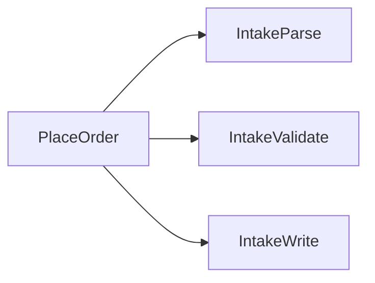
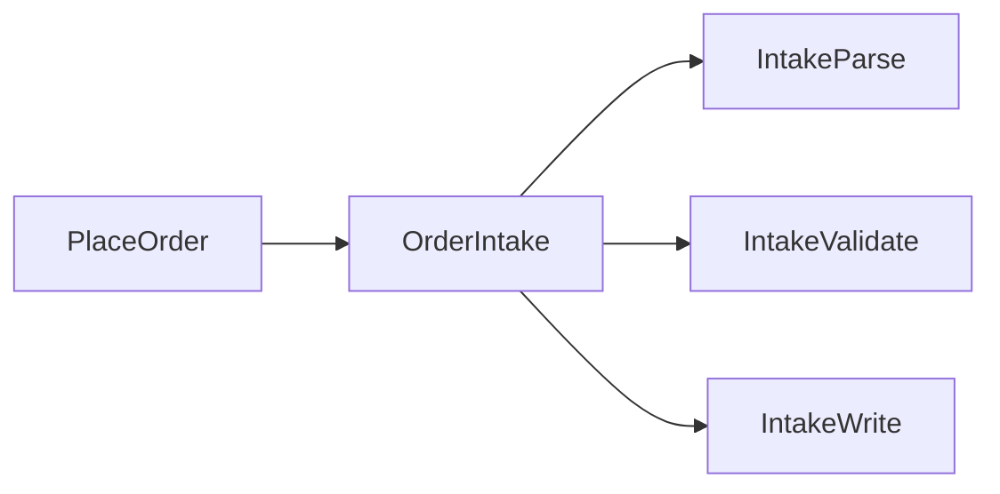

# Architecture survey: <repo>

Scope: <direction, hotspot paths, or whole tree>

Legend: **Strength** is one of Strong, Worth exploring, Speculative.

Write wins in glossary terms. Use exactly: locality, leverage, interface, depth, seam, adapter, module.

If the diagram needs a paragraph, redraw the diagram. Markdown and Mermaid only.

When a finding contradicts ADR-NNNN, add `**ADR**: contradicts ADR-NNNN, but worth reopening because …`.

Do not invent a candidate when the explorers found no friction. Then `## Top recommendation` is `No candidates` and names the scope.

## Fold order intake behind one interface

**Strength**: Strong

**Files**: `src/orders/intake.ts`, `src/orders/intake_http.ts`

**Problem**: Callers bounce across three files to place one order.

**Solution**: One module at the intake seam, with a single interface callers already almost have.

**Wins**:
- locality: change concentrates in one module
- leverage: one implementation pays back across every caller and test
- interface: tests stand at the same seam as callers

**Before**:

**After**:

## Top recommendation

Fold order intake behind one interface — Strong, highest leverage in this scope.
