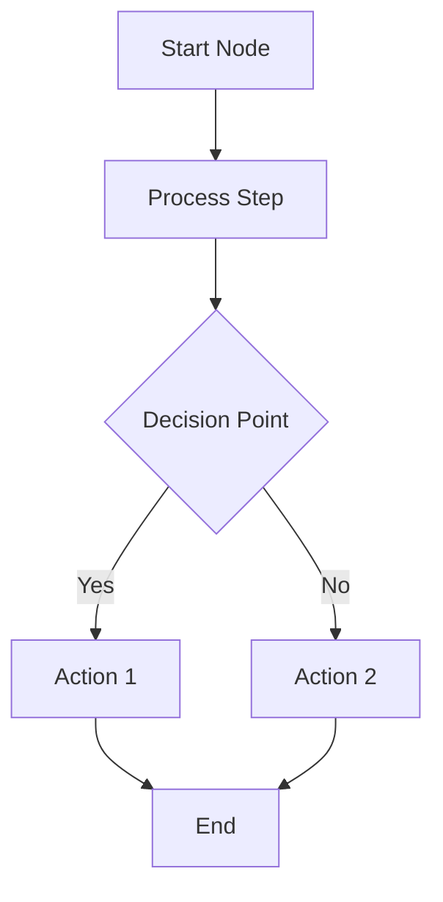
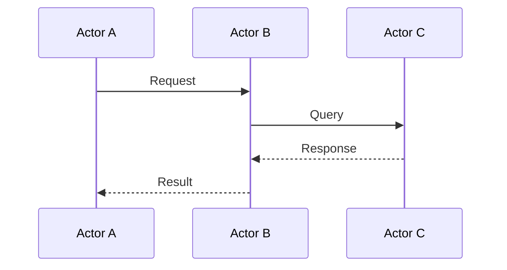
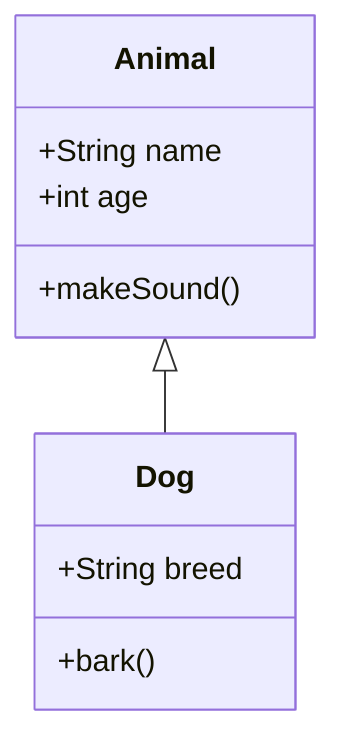
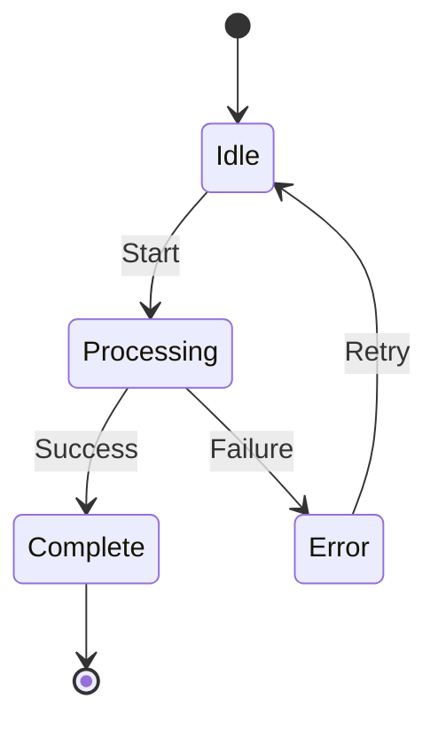
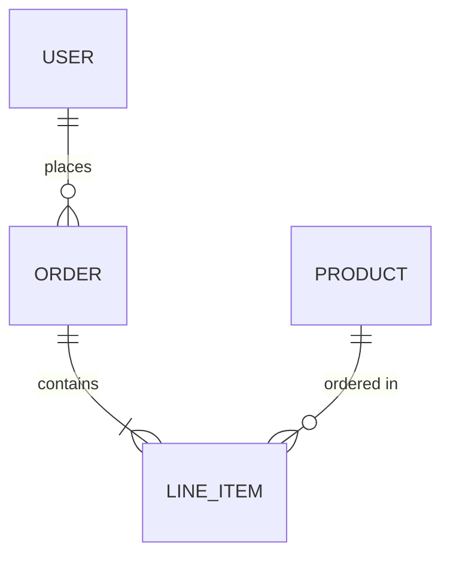
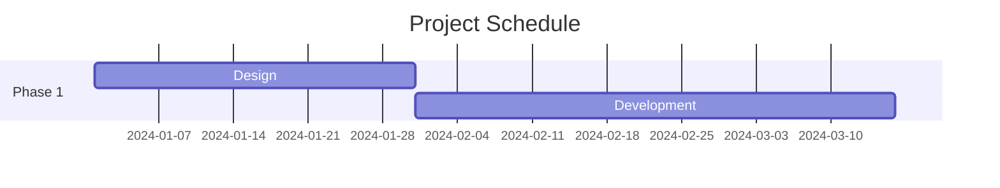
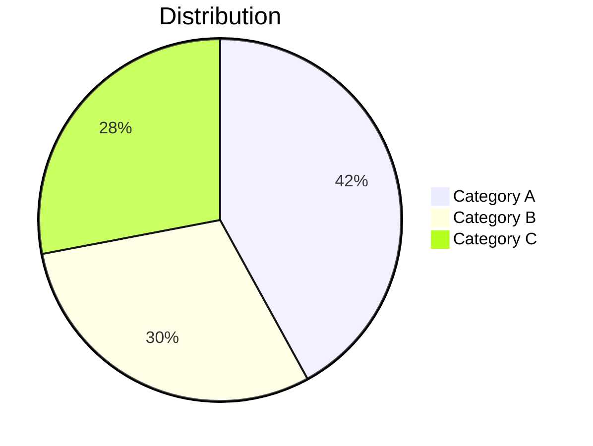
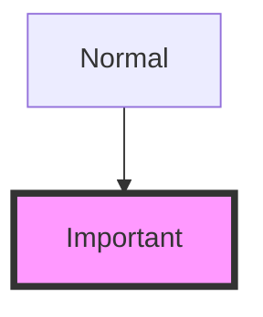
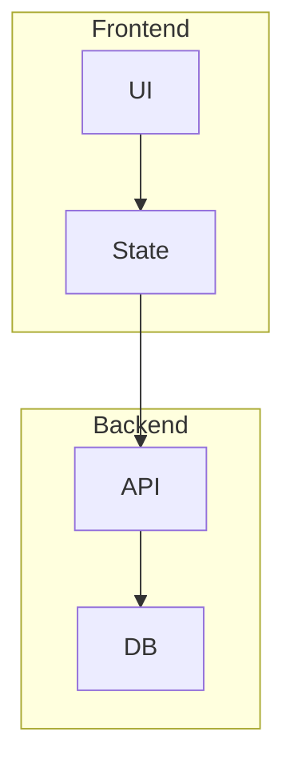

# Mermaid Diagram Types Reference

## 1. Flowchart / Graph

**Use for**: Process flows, decision trees, algorithms, workflows

**Direction options**: `TD` (top-down), `LR` (left-right), `BT` (bottom-top), `RL` (right-left)

**Node shapes**:
- `[Rectangle]` — standard process
- `(Rounded)` — start/end points
- `{Diamond}` — decisions
- `[[Subroutine]]` — predefined process
- `[(Database)]` — data storage

## 2. Sequence Diagram

**Use for**: API interactions, system communications, time-based flows

## 3. Class Diagram

**Use for**: Object-oriented design, data models, entity relationships

## 4. State Diagram

**Use for**: State machines, workflow states, status transitions

## 5. Entity Relationship Diagram

**Use for**: Database schemas, data relationships

## 6. Gantt Chart

**Use for**: Project timelines, task scheduling

## 7. Pie Chart

**Use for**: Data distribution, proportions

## Best Practices

**DO**:
- Use descriptive node labels (e.g., "User Authentication" not "Auth")
- Keep diagrams focused: 5-15 nodes optimal
- Use quotes for labels with spaces: `A["User Input"]`
- Use subgraphs to organize complex flowcharts
- Include meaningful arrow labels for decision branches

**DON'T**:
- Create overly complex diagrams (>20 nodes) — split into multiple
- Use very long text in labels (>30 chars) — breaks layout
- Use spaces in node IDs (use camelCase or underscores)
- Mix diagram types in a single chart

## Styling (Optional)

## Subgraphs

