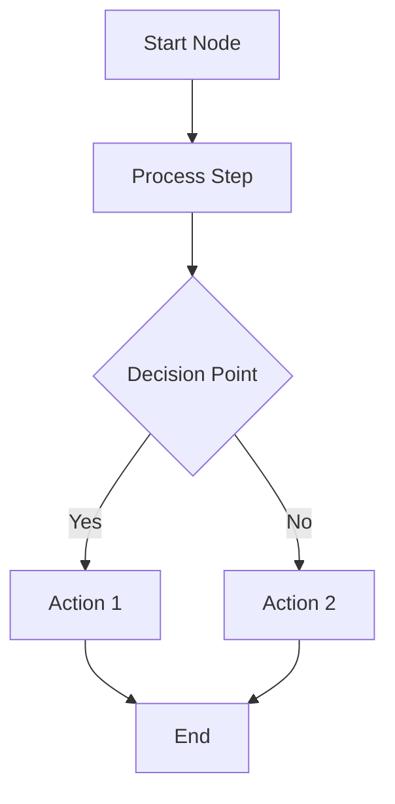
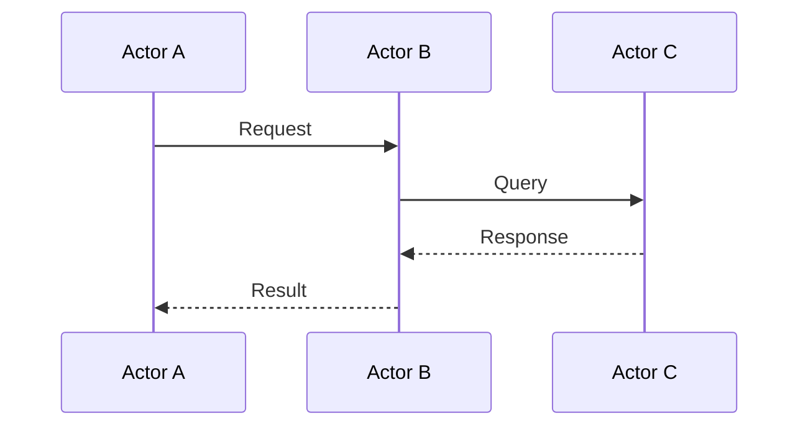
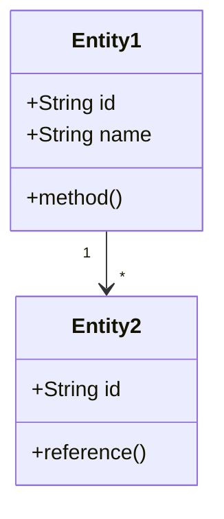
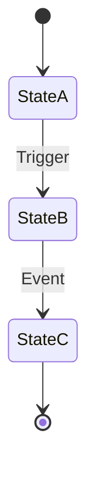
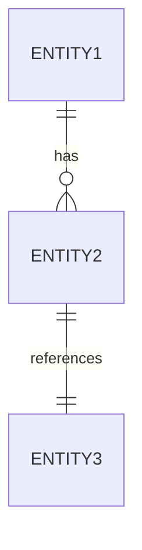

# Quick Diagram Generator

An interactive command to quickly generate and display Mermaid diagrams. This skill guides users through creating diagrams by asking what they need and automatically generating and displaying the result.

## When to Use

This skill is designed to be **user-invoked** with the `/diagram` command. Use it when:
- User wants to quickly create a diagram without typing detailed instructions
- User prefers an interactive dialog to specify their needs
- User isn't sure what diagram type would work best

## Workflow

### Step 1: Ask User What They Want

Use the AskUserQuestion tool to gather diagram requirements:

**Question 1: Diagram Type**
Ask the user what type of diagram they need. Provide options:
- Flowchart (Process flows, decision trees)
- Sequence Diagram (API interactions, communications)
- Class Diagram (Object-oriented design, data models)
- State Diagram (State machines, workflows)
- ER Diagram (Database schemas)
- Other (User specifies)

**Question 2: Diagram Content**
Ask the user to describe what the diagram should show. This should be a free-form text input where they can describe:
- The scenario or system to visualize
- Key components or actors
- Relationships or flows
- Any specific requirements

### Step 2: Generate Mermaid Code

Based on the user's input:
1. Determine the appropriate Mermaid diagram syntax
2. Generate clean, well-structured Mermaid code
3. Include meaningful labels and clear relationships
4. Follow Mermaid best practices:
   - Use descriptive node IDs (no spaces)
   - Keep labels concise (<30 characters)
   - Use appropriate arrow types for the diagram type
   - Include decision branches where relevant

### Step 3: Render to PNG

Create a temporary file and render:

```bash
# Generate timestamp
timestamp=$(date +%s)

# Write Mermaid code to file
# [Use Write tool to create /tmp/diagram-${timestamp}.mmd]

# Render to PNG with transparent background
mmdc -i /tmp/diagram-${timestamp}.mmd -o /tmp/diagram-${timestamp}.png -b transparent

# Open the image
open /tmp/diagram-${timestamp}.png
```

### Step 4: Inform User

Let the user know the diagram has been generated and opened:

```
I've created your [diagram type] and opened it in your default image viewer.

[Brief description of what the diagram shows]

File saved to: /tmp/diagram-{timestamp}.png
```

## Example Interaction

### User Invokes Command
```
/diagram
```

### Claude Asks Questions

**Question 1: Diagram Type**
```
What type of diagram would you like to create?
- Flowchart
- Sequence Diagram
- Class Diagram
- State Diagram
- ER Diagram
- Other
```

User selects: **Sequence Diagram**

**Question 2: Describe Your Diagram**
```
Please describe what you want to visualize:
(Example: "Show how a user logs in through OAuth 2.0" or "API request flow with caching and database")
```

User inputs: **"Show the checkout process in an e-commerce system with payment gateway integration"**

### Claude Generates and Displays

```
I've created a sequence diagram showing the e-commerce checkout process and opened it in your default image viewer.

The diagram shows:
- User initiating checkout
- Frontend validating cart
- Backend processing order
- Payment gateway integration
- Order confirmation flow
- Email notification trigger

File saved to: /tmp/diagram-1769495847.png
```

## Mermaid Code Examples by Type

### Flowchart Template


### Sequence Diagram Template


### Class Diagram Template


### State Diagram Template


### ER Diagram Template


## Best Practices

### Understanding User Intent

When the user describes what they want, identify:
- **Actors/Components**: Who or what is involved?
- **Actions/Operations**: What happens?
- **Sequence**: Is there a time order?
- **Decisions**: Are there conditional branches?
- **Relationships**: How do things connect?

This helps you choose the right diagram type if they selected "Other" or if their description suggests a different type would work better.

### Generating Quality Diagrams

**DO** ✓
- Use clear, descriptive labels
- Keep the diagram focused (5-15 nodes)
- Use consistent naming conventions
- Add decision branches where relevant
- Include proper arrow directions
- Use meaningful node IDs

**DON'T** ✗
- Create overly complex diagrams (>20 nodes)
- Use cryptic abbreviations
- Mix unrelated concepts in one diagram
- Skip important relationships
- Use very long text labels

### Handling Complex Requirements

If the user's description is too complex for a single diagram:
1. Suggest breaking it into multiple diagrams
2. Ask which aspect they want to focus on first
3. Offer to create additional diagrams after the first one

Example response:
```
Your description covers multiple aspects. I suggest creating separate diagrams for:
1. High-level system architecture (Flowchart)
2. User authentication flow (Sequence Diagram)
3. Data model (ER Diagram)

Which one would you like me to create first?
```

## Error Handling

### Invalid Diagram Type Selection

If the user selects "Other" and provides an unsupported type:
```
I'll create this as a [closest matching type]. Mermaid supports:
- Flowcharts, Sequence Diagrams, Class Diagrams, State Diagrams, ER Diagrams, Gantt Charts, Pie Charts

Proceeding with: [selected type]
```

### Unclear Description

If the description is too vague:
```
To create a helpful diagram, I need a bit more detail. Could you describe:
- What are the main components or actors?
- What actions or flows should be shown?
- Are there any decision points or conditions?
```

### Tool Not Installed

If mmdc is not available:
```
Error: mermaid-cli is not installed.

To use the diagram generator, please install it:
npm install -g @mermaid-js/mermaid-cli

After installation, run /diagram again.
```

## Tips for Users

### Describing Flowcharts
- Mention the starting point and end point
- Describe decision branches
- List the main steps in order

Example: "User login process: start with username/password input, validate credentials, if valid go to dashboard, if invalid show error and retry"

### Describing Sequence Diagrams
- List the actors/systems involved
- Describe the message flow in order
- Mention request/response patterns

Example: "Show API request flow: user sends request to API gateway, gateway authenticates with auth service, then forwards to backend, backend queries database, response flows back"

### Describing Class Diagrams
- List the main entities/classes
- Describe their attributes
- Explain the relationships (one-to-many, inheritance, etc.)

Example: "Blog system with User, Post, and Comment. User has many Posts, Post has many Comments, both have timestamps and IDs"

### Describing State Diagrams
- List the possible states
- Describe the transitions between states
- Mention what triggers each transition

Example: "Order states: Pending, Processing, Shipped, Delivered, Cancelled. Orders move from Pending to Processing when payment confirms, to Shipped when dispatched, to Delivered when received"

## Advanced Options

Users can request specific rendering options in their description:

**High resolution:**
"Create a high-resolution flowchart showing..."
→ Add `-s 2` or `-w 1600` to mmdc command

**Specific background:**
"Create a diagram with white background for printing..."
→ Use `-b white` instead of `-b transparent`

**Large diagram:**
"Create a detailed, large diagram showing..."
→ Increase width: `-w 1600`

## Follow-up Actions

After creating a diagram, offer to:
1. Create related diagrams
2. Modify the current diagram
3. Export in different formats or sizes
4. Explain specific parts of the diagram

Example:
```
Would you like me to:
- Create additional diagrams for other parts of the system?
- Modify this diagram (add/remove components)?
- Generate a higher resolution version?
```

## Summary

The `/diagram` command provides a frictionless way to create visual diagrams through an interactive dialog. By asking targeted questions and generating appropriate Mermaid syntax, it helps users quickly visualize their ideas without needing to know Mermaid syntax or make detailed requests.

**Usage:**
1. Type `/diagram`
2. Answer two quick questions
3. Get your diagram automatically generated and displayed

Simple, fast, effective.
