# Mermaid Diagram Display

Display Mermaid diagrams as high-quality PNG or SVG images that automatically open in your default viewer. This provides clear, professional visualization for flowcharts, sequence diagrams, class diagrams, and more.

## When to Use

Use this skill when:
- User requests visual diagrams (flowcharts, sequence diagrams, architecture diagrams, etc.)
- Explaining system architecture, data flows, or process workflows
- Complex relationships are better shown graphically than in text
- Creating documentation that benefits from visual aids
- Designing state machines, API interactions, or database schemas

Do NOT use when:
- Simple text descriptions are sufficient
- User explicitly prefers text-only output
- Diagram would be trivial (2-3 simple nodes with obvious relationships)

## Prerequisites

**No installation required!** This skill automatically uses mermaid-cli via `npx`.

**Requirements**: Only npm/Node.js (which you likely already have)

**Optional: Install for faster execution**
If you frequently create diagrams, install mermaid-cli globally for instant execution:

```bash
npm install -g @mermaid-js/mermaid-cli
```

**Tool selection priority**:
1. `mmdc` (if installed) - Fastest (~50ms)
2. `npx -y @mermaid-js/mermaid-cli` (fallback) - Universal compatibility (~300ms after cache)

## Configuration

**Simplified environment variables** (only 2 variables):

```bash
# Output format (png or svg)
export MERMAID_OUTPUT_FORMAT=png  # or svg

# Color scheme (set by mermaid-theme skill, or use default)
export MERMAID_COLOR_SCHEME=tokyo-night
```

**Available color schemes**:
- `tokyo-night` - Deep blue-purple tones (dark theme)
- `nord` - Ice blue tones (dark theme)
- `catppuccin-mocha` - Warm purple tones (dark theme)
- `catppuccin-latte` - Warm tones (light theme)
- `dracula` - Purple-pink tones (dark theme)
- `github-dark` - Deep blue tones (dark theme)
- `github-light` - Light blue tones (light theme)
- `solarized-dark` - Amber-blue tones (dark theme)
- `default` - Mermaid default theme (no custom colors)

**For custom colors** (advanced users):
```bash
export MERMAID_COLOR_SCHEME=custom
export MERMAID_PRIMARY_COLOR=#7aa2f7
export MERMAID_SECONDARY_COLOR=#bb9af7
export MERMAID_TEXT_COLOR=#c0caf5
```

**Usage examples**:

One-time use:
```bash
MERMAID_COLOR_SCHEME=nord claude
```

Persistent (recommended - use mermaid-theme skill):
```bash
# The mermaid-theme skill creates ~/.mermaid-theme.sh
source ~/.mermaid-theme.sh
```

SVG output (vector format, infinite zoom):
```bash
export MERMAID_OUTPUT_FORMAT=svg
```

## Workflow

### Step 1: Generate Mermaid Code

Based on user requirements, create valid Mermaid syntax. Choose the appropriate diagram type:

**Flowchart (Process flows, algorithms)**:


**Sequence Diagram (API interactions, communications)**:
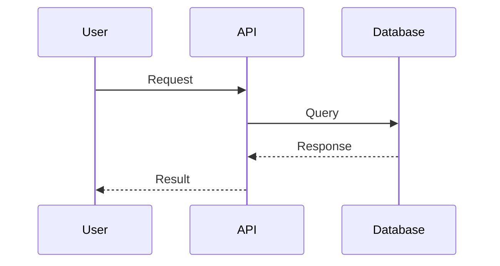

**Class Diagram (Object-oriented design)**:
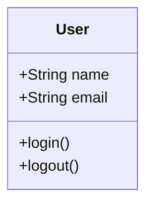

### Step 2: Save to Temporary File

Use Write tool to create a temporary Mermaid file with timestamp to avoid conflicts:

**File path pattern**: `/tmp/mermaid-diagram-{unix-timestamp}.mmd`

**Example**:
```
/tmp/mermaid-diagram-1706382451.mmd
```

Use `date +%s` in bash to get current Unix timestamp.

### Step 3: Render to PNG/SVG with Theme

Use Bash tool to convert Mermaid to PNG/SVG with automatic theme configuration:

```bash
#!/bin/bash

# Step 3.1: Tool Selection
if command -v mmdc &> /dev/null; then
    MERMAID_CMD="mmdc"
elif command -v npx &> /dev/null; then
    MERMAID_CMD="npx -y @mermaid-js/mermaid-cli"
else
    echo "Error: No mermaid renderer available. Install Node.js or mermaid-cli."
    exit 1
fi

# Step 3.2: Configuration
TIMESTAMP=$(date +%s)
INPUT_FILE="/tmp/mermaid-diagram-${TIMESTAMP}.mmd"
FORMAT=${MERMAID_OUTPUT_FORMAT:-png}
OUTPUT_FILE="/tmp/mermaid-diagram-${TIMESTAMP}.${FORMAT}"
SCHEME=${MERMAID_COLOR_SCHEME:-default}

# Step 3.3: Generate Theme Configuration
TEMP_CONFIG=""
if [ "$SCHEME" != "default" ]; then
    TEMP_CONFIG="/tmp/mermaid-config-${TIMESTAMP}.json"

    case "$SCHEME" in
        tokyo-night)
            cat > "$TEMP_CONFIG" <<'EOF'
{
  "theme": "base",
  "themeVariables": {
    "primaryColor": "#7aa2f7",
    "secondaryColor": "#bb9af7",
    "primaryTextColor": "#c0caf5",
    "background": "transparent",
    "lineColor": "#565f89",
    "tertiaryColor": "#9ece6a",
    "primaryBorderColor": "#565f89",
    "secondaryBorderColor": "#565f89",
    "tertiaryBorderColor": "#565f89"
  }
}
EOF
            ;;
        nord)
            cat > "$TEMP_CONFIG" <<'EOF'
{
  "theme": "base",
  "themeVariables": {
    "primaryColor": "#88c0d0",
    "secondaryColor": "#81a1c1",
    "primaryTextColor": "#eceff4",
    "background": "transparent",
    "lineColor": "#4c566a",
    "tertiaryColor": "#a3be8c",
    "primaryBorderColor": "#4c566a",
    "secondaryBorderColor": "#4c566a",
    "tertiaryBorderColor": "#4c566a"
  }
}
EOF
            ;;
        catppuccin-mocha)
            cat > "$TEMP_CONFIG" <<'EOF'
{
  "theme": "base",
  "themeVariables": {
    "primaryColor": "#89b4fa",
    "secondaryColor": "#cba6f7",
    "primaryTextColor": "#cdd6f4",
    "background": "transparent",
    "lineColor": "#6c7086",
    "tertiaryColor": "#a6e3a1",
    "primaryBorderColor": "#6c7086",
    "secondaryBorderColor": "#6c7086",
    "tertiaryBorderColor": "#6c7086"
  }
}
EOF
            ;;
        catppuccin-latte)
            cat > "$TEMP_CONFIG" <<'EOF'
{
  "theme": "base",
  "themeVariables": {
    "primaryColor": "#1e66f5",
    "secondaryColor": "#8839ef",
    "primaryTextColor": "#4c4f69",
    "background": "transparent",
    "lineColor": "#9ca0b0",
    "tertiaryColor": "#40a02b",
    "primaryBorderColor": "#9ca0b0",
    "secondaryBorderColor": "#9ca0b0",
    "tertiaryBorderColor": "#9ca0b0"
  }
}
EOF
            ;;
        dracula)
            cat > "$TEMP_CONFIG" <<'EOF'
{
  "theme": "base",
  "themeVariables": {
    "primaryColor": "#bd93f9",
    "secondaryColor": "#ff79c6",
    "primaryTextColor": "#f8f8f2",
    "background": "transparent",
    "lineColor": "#6272a4",
    "tertiaryColor": "#50fa7b",
    "primaryBorderColor": "#6272a4",
    "secondaryBorderColor": "#6272a4",
    "tertiaryBorderColor": "#6272a4"
  }
}
EOF
            ;;
        github-dark)
            cat > "$TEMP_CONFIG" <<'EOF'
{
  "theme": "base",
  "themeVariables": {
    "primaryColor": "#58a6ff",
    "secondaryColor": "#79c0ff",
    "primaryTextColor": "#c9d1d9",
    "background": "transparent",
    "lineColor": "#30363d",
    "tertiaryColor": "#56d364",
    "primaryBorderColor": "#30363d",
    "secondaryBorderColor": "#30363d",
    "tertiaryBorderColor": "#30363d"
  }
}
EOF
            ;;
        github-light)
            cat > "$TEMP_CONFIG" <<'EOF'
{
  "theme": "base",
  "themeVariables": {
    "primaryColor": "#0969da",
    "secondaryColor": "#0550ae",
    "primaryTextColor": "#24292f",
    "background": "transparent",
    "lineColor": "#d0d7de",
    "tertiaryColor": "#1a7f37",
    "primaryBorderColor": "#d0d7de",
    "secondaryBorderColor": "#d0d7de",
    "tertiaryBorderColor": "#d0d7de"
  }
}
EOF
            ;;
        solarized-dark)
            cat > "$TEMP_CONFIG" <<'EOF'
{
  "theme": "base",
  "themeVariables": {
    "primaryColor": "#268bd2",
    "secondaryColor": "#2aa198",
    "primaryTextColor": "#839496",
    "background": "transparent",
    "lineColor": "#586e75",
    "tertiaryColor": "#859900",
    "primaryBorderColor": "#586e75",
    "secondaryBorderColor": "#586e75",
    "tertiaryBorderColor": "#586e75"
  }
}
EOF
            ;;
        custom)
            # Use custom colors from environment variables
            PRIMARY=${MERMAID_PRIMARY_COLOR:-#7aa2f7}
            SECONDARY=${MERMAID_SECONDARY_COLOR:-#bb9af7}
            TEXT=${MERMAID_TEXT_COLOR:-#c0caf5}
            cat > "$TEMP_CONFIG" <<EOF
{
  "theme": "base",
  "themeVariables": {
    "primaryColor": "$PRIMARY",
    "secondaryColor": "$SECONDARY",
    "primaryTextColor": "$TEXT",
    "background": "transparent",
    "lineColor": "#565f89",
    "primaryBorderColor": "#565f89",
    "secondaryBorderColor": "#565f89"
  }
}
EOF
            ;;
        *)
            # Unknown scheme, fall back to default
            SCHEME="default"
            ;;
    esac
fi

# Step 3.4: Render Diagram
if [ "$SCHEME" = "default" ]; then
    # Use default Mermaid theme (no config file)
    $MERMAID_CMD \
        -i "$INPUT_FILE" \
        -o "$OUTPUT_FILE" \
        -b transparent
else
    # Use custom theme configuration
    $MERMAID_CMD \
        -i "$INPUT_FILE" \
        -o "$OUTPUT_FILE" \
        -c "$TEMP_CONFIG" \
        -b transparent

    # Cleanup temporary config
    rm -f "$TEMP_CONFIG"
fi

# Output the file path for the next step
echo "$OUTPUT_FILE"
```

**Important notes**:
- All themes use `transparent` background by default
- Temporary config files are automatically cleaned up
- SVG output is supported natively by mmdc (just change the extension)
- First-time npx execution will download mermaid-cli (~100MB, 10-20 seconds)

### Step 4: Open Image in Default Viewer

Use Bash tool to open the PNG/SVG file with platform-specific command:

```bash
# Platform detection and open
case "$OSTYPE" in
  darwin*)
    # macOS
    open "$OUTPUT_FILE"
    ;;
  linux*)
    # Linux
    xdg-open "$OUTPUT_FILE"
    ;;
  msys*|cygwin*|win32)
    # Windows (Git Bash, Cygwin, etc.)
    start "$OUTPUT_FILE"
    ;;
  *)
    # Fallback: just echo the path
    echo "Diagram saved to: $OUTPUT_FILE"
    echo "Please open the file manually."
    ;;
esac
```

**Cross-platform support**:
- macOS: `open` command (Preview, Photos, etc.)
- Linux: `xdg-open` command (default image viewer)
- Windows: `start` command (default image viewer)
- Other: Displays file path for manual opening

### Step 5: Inform User

Let the user know the diagram has been opened:

```
I've generated and opened the [diagram type] in your default image viewer using the [color-scheme-name] theme.
```

Provide the file path so they can reference it later:

```
Diagram saved to: /tmp/mermaid-diagram-{timestamp}.{format}
```

If SVG format was used, mention the benefits:
```
The SVG format provides infinite zoom and smaller file size compared to PNG.
```

### Step 6: Cleanup (Optional)

The files are in `/tmp` and will be automatically cleaned by the system, but you can provide cleanup instructions if requested:

```bash
rm /tmp/mermaid-diagram-{timestamp}.mmd /tmp/mermaid-diagram-{timestamp}.{format}
```

## Error Handling

### No Renderer Available

If all rendering methods fail:
```
Error: No mermaid renderer available.

Solutions:
1. Install Node.js (includes npm): brew install node
2. Install mermaid-cli globally: npm install -g @mermaid-js/mermaid-cli

Either option will enable diagram rendering.
```

### Slow First Execution

If first execution takes 10-20 seconds:
- **Cause**: npx downloading mermaid-cli (~100MB) on first use
- **Solution**: This only happens once. Package is cached for future use (~300ms after cache)
- **Optional**: Install globally for instant execution: `npm install -g @mermaid-js/mermaid-cli`

### Invalid Mermaid Syntax

If rendering fails due to syntax errors:
1. Check Mermaid syntax validity
2. Provide corrected syntax to user
3. Suggest testing at https://mermaid.live

### Theme Not Applied

If custom theme is not working:
- **Check**: Verify `MERMAID_COLOR_SCHEME` is set: `echo $MERMAID_COLOR_SCHEME`
- **Solution**: Use the `mermaid-theme` skill to configure themes properly
- **Fallback**: System will use default theme if scheme name is invalid

### File Permission Issues

If write/read fails:

```bash
# Ensure /tmp is writable
ls -ld /tmp

# Use alternative location if needed
~/Downloads/mermaid-diagram-{timestamp}.mmd
```

## Best Practices

### DO ✓

- Use descriptive node labels (e.g., "User Authentication" not "Auth")
- Keep diagrams focused: 5-15 nodes is optimal for readability
- Choose the right diagram type for the content:
  - Flowchart: Process flows, decision trees
  - Sequence: Time-based interactions, API calls
  - Class: Object structure, data models
  - State: State machines, workflows
  - ER: Database schemas
- Use SVG format for documentation (infinite zoom, smaller files)
- Use PNG format for sharing (universal compatibility)
- Include meaningful arrows labels for decision branches
- Use subgraphs to organize complex flowcharts

### DON'T ✗

- Create overly complex diagrams (>20 nodes) - split into multiple diagrams instead
- Use very long text in node labels (breaks layout) - keep labels under 30 characters
- Skip error checking for tool availability
- Use spaces in node IDs (use camelCase or underscores)
- Force diagrams when simple text would be clearer
- Mix diagram types in a single chart

## Common Diagram Types

### 1. Flowchart / Graph
**Use for**: Process flows, decision trees, algorithms, workflows

**Syntax**:
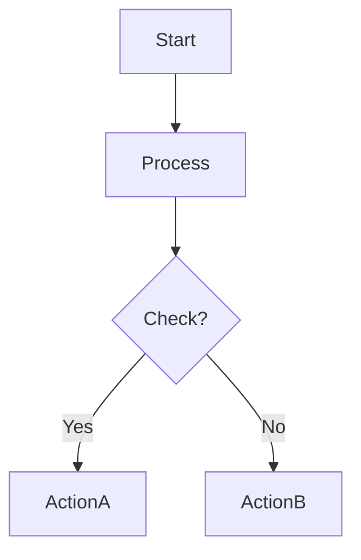

**Direction options**: `TD` (top-down), `LR` (left-right), `BT` (bottom-top), `RL` (right-left)

### 2. Sequence Diagram
**Use for**: API interactions, system communications, time-based flows

**Syntax**:
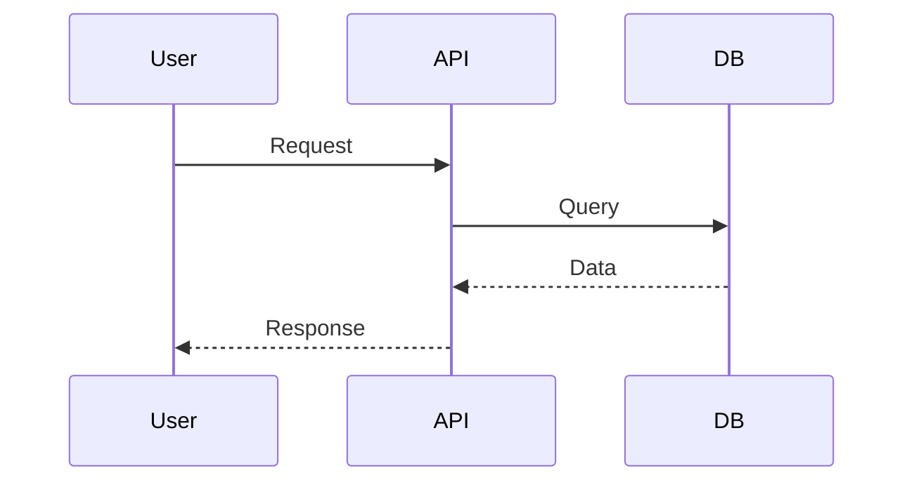

### 3. Class Diagram
**Use for**: Object-oriented design, data models, entity relationships

**Syntax**:
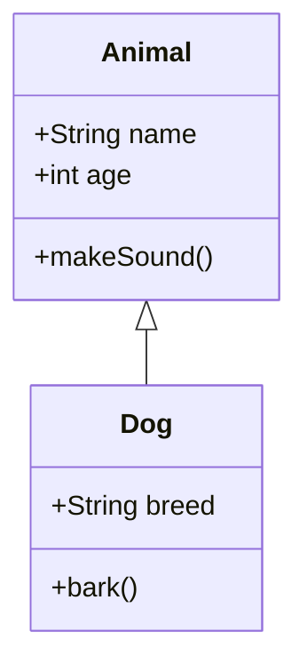

### 4. State Diagram
**Use for**: State machines, workflow states, status transitions

**Syntax**:
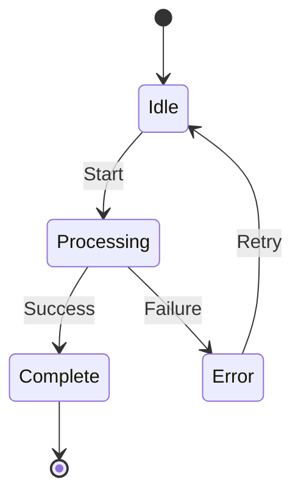

### 5. Entity Relationship Diagram
**Use for**: Database schemas, data relationships

**Syntax**:
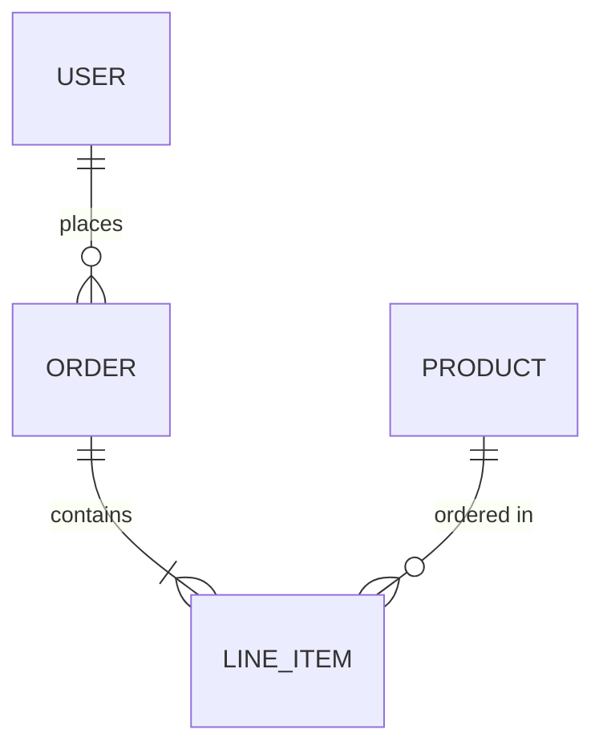

### 6. Gantt Chart
**Use for**: Project timelines, task scheduling

**Syntax**:
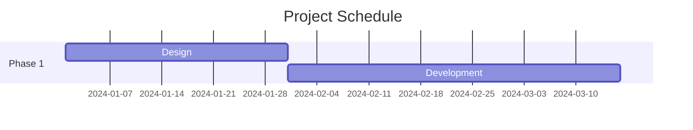

### 7. Pie Chart
**Use for**: Data distribution, proportions

**Syntax**:
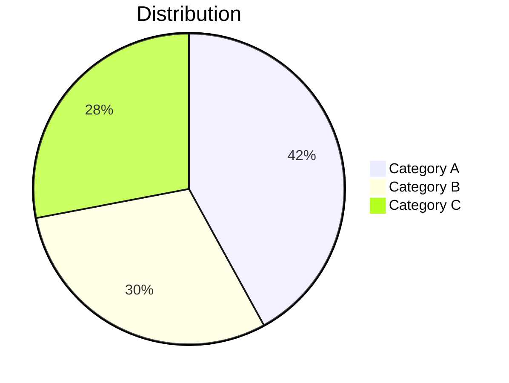

## Complete Example

### User Request
"Show me how user authentication works in a typical web application."

### Response Workflow

**Step 1**: Generate sequence diagram code

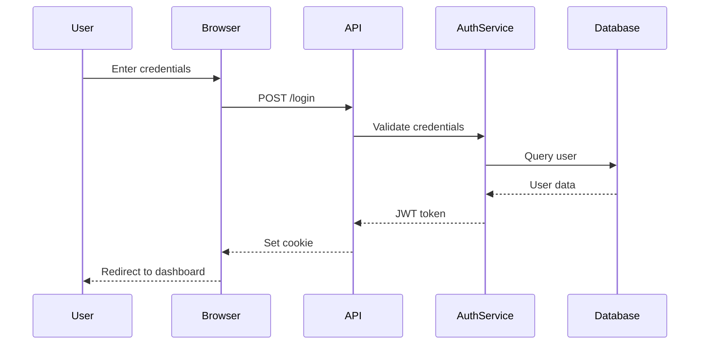

**Step 2**: Write to file
```bash
timestamp=$(date +%s)
```
[Use Write tool to create `/tmp/mermaid-diagram-${timestamp}.mmd` with the Mermaid code]

**Step 3**: Render with theme
[Use the complete bash script from Step 3 above]

**Step 4**: Open image
[Use the platform-specific open command from Step 4 above]

**Step 5**: Inform user
```
I've created a sequence diagram showing the authentication flow using the tokyo-night theme and opened it in your default image viewer. The diagram illustrates the interaction between the user, browser, API, authentication service, and database during the login process.

Diagram saved to: /tmp/mermaid-diagram-1706382451.png
```

## Tips for Better Diagrams

### Labels and Formatting
- Use quotes for labels with spaces: `A["User Input"]`
- Use different node shapes:
  - `[Rectangle]` - standard process
  - `(Rounded)` - start/end points
  - `{Diamond}` - decisions
  - `[[Subroutine]]` - predefined process
  - `[(Database)]` - data storage

### Styling (Optional)
Add custom styles for emphasis:
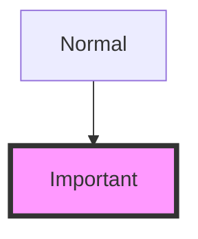

### Subgraphs
Organize complex diagrams:
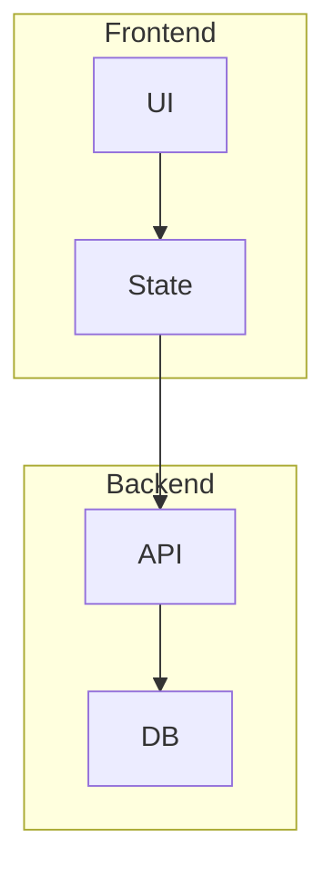

## Advanced Configuration

### SVG vs PNG

**SVG (Vector Format)**:
- ✓ Infinite zoom without quality loss
- ✓ Smaller file size (typically 30-50% of PNG)
- ✓ Perfect for documentation and web
- ✗ Less universal compatibility

**PNG (Raster Format)**:
- ✓ Universal compatibility
- ✓ Works everywhere (email, chat, etc.)
- ✗ Fixed resolution
- ✗ Larger file size

**Recommendation**: Use SVG for documentation, PNG for sharing.

### Custom Themes

For advanced customization, use the `custom` color scheme:

```bash
export MERMAID_COLOR_SCHEME=custom
export MERMAID_PRIMARY_COLOR=#your-hex-color
export MERMAID_SECONDARY_COLOR=#your-hex-color
export MERMAID_TEXT_COLOR=#your-hex-color
```

Or use the `mermaid-theme` skill for interactive theme selection.

## Troubleshooting

| Issue | Solution |
|-------|----------|
| Theme not applied | Check `echo $MERMAID_COLOR_SCHEME`, use mermaid-theme skill |
| Diagram not opening | Check platform support, verify file exists at output path |
| Text overlapping | Shorten labels or use abbreviations |
| Layout looks wrong | Try different direction (TD vs LR) or restructure nodes |
| Complex diagram unreadable | Split into multiple smaller diagrams |
| SVG not rendering | Ensure mmdc/npx is up to date, try PNG format |

## Reference

- **Mermaid Documentation**: https://mermaid.js.org/
- **Live Editor**: https://mermaid.live (for testing syntax)
- **CLI Documentation**: https://github.com/mermaid-js/mermaid-cli

---

**Remember**: The goal is clarity. If a diagram becomes too complex, simplify it or split it into multiple focused diagrams. Use the right color scheme to match your environment (dark/light) and output format (SVG/PNG) based on your use case.
