# Mermaid Diagram Display

Display Mermaid diagrams as high-quality PNG images that automatically open in your default image viewer. This provides clear, professional visualization for flowcharts, sequence diagrams, class diagrams, and more.

## When to Use

Use this skill when:
- User requests visual diagrams (flowcharts, sequence diagrams, architecture diagrams, etc.)
- Explaining system architecture, data flows, or process workflows
- Complex relationships are better shown graphically than in text
- Creating documentation that benefits from visual aids
- Designing state machines, API interactions, or database schemas

Do NOT use when:
- Simple text descriptions are sufficient
- User explicitly prefers text-only output
- Diagram would be trivial (2-3 simple nodes with obvious relationships)

## Prerequisites

This skill requires `mermaid-cli` to be installed. If not installed, provide installation instructions:

```bash
npm install -g @mermaid-js/mermaid-cli
```

Verify installation:
```bash
mmdc --version
```

## Workflow

### Step 1: Generate Mermaid Code

Based on user requirements, create valid Mermaid syntax. Choose the appropriate diagram type:

**Flowchart (Process flows, algorithms)**:


**Sequence Diagram (API interactions, communications)**:
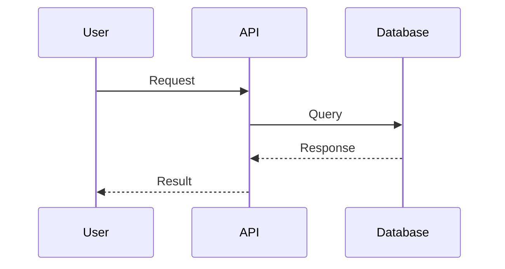

**Class Diagram (Object-oriented design)**:
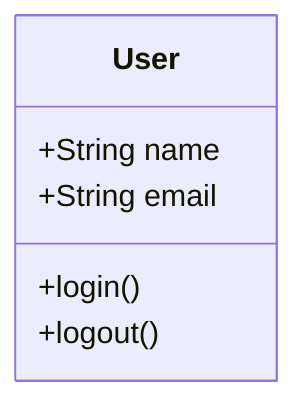

### Step 2: Save to Temporary File

Use Write tool to create a temporary Mermaid file with timestamp to avoid conflicts:

**File path pattern**: `/tmp/mermaid-diagram-{unix-timestamp}.mmd`

**Example**:
```
/tmp/mermaid-diagram-1706382451.mmd
```

Use `date +%s` in bash to get current Unix timestamp, or use a descriptive name if the diagram has specific context.

### Step 3: Render to PNG

Use Bash tool to convert Mermaid to PNG using mmdc:

```bash
mmdc -i /tmp/mermaid-diagram-{timestamp}.mmd -o /tmp/mermaid-diagram-{timestamp}.png -b transparent
```

**Parameters**:
- `-i`: Input Mermaid file path
- `-o`: Output PNG file path
- `-b transparent`: Transparent background (recommended for better viewing)
- Alternative: `-b white` or `-b black` if transparency causes issues

**Optional quality parameters**:
- `-w 1200`: Set width (default 800)
- `-H 800`: Set height (auto-calculated by default)
- `-s 2`: Scale factor for higher resolution

### Step 4: Open Image in Default Viewer

Use Bash tool to open the PNG file with macOS `open` command:

```bash
open /tmp/mermaid-diagram-{timestamp}.png
```

The image will automatically open in the user's default image viewer (Preview, Photos, etc.).

### Step 5: Inform User

Let the user know the diagram has been opened:

```
I've generated and opened the [diagram type] in your default image viewer.
```

Optionally provide the file path so they can reference it later:

```
The diagram has been saved to: /tmp/mermaid-diagram-{timestamp}.png
```

### Step 6: Cleanup (Optional)

The files are in `/tmp` and will be automatically cleaned by the system, but you can provide cleanup instructions if requested:

```bash
rm /tmp/mermaid-diagram-{timestamp}.mmd /tmp/mermaid-diagram-{timestamp}.png
```

## Error Handling

### Tool Not Installed

If `mmdc` command fails with "command not found":

```
Error: mermaid-cli is not installed. Please install it with:
npm install -g @mermaid-js/mermaid-cli

After installation, I can generate the diagram for you.
```

### Invalid Mermaid Syntax

If mmdc fails to render due to syntax errors:

1. Check the Mermaid syntax against the [official docs](https://mermaid.js.org/)
2. Test the syntax at https://mermaid.live to validate
3. Provide corrected syntax to the user
4. Common issues:
   - Missing arrow syntax (`-->`, `->`, `->>`)
   - Invalid node IDs (must start with letter, no spaces)
   - Unmatched quotes in labels
   - Invalid diagram type declaration

### File Permission Issues

If write/read fails:

```bash
# Ensure /tmp is writable
ls -ld /tmp

# Use alternative location if needed
~/Downloads/mermaid-diagram-{timestamp}.mmd
```

## Best Practices

### DO ✓

- Use descriptive node labels (e.g., "User Authentication" not "Auth")
- Keep diagrams focused: 5-15 nodes is optimal for readability
- Choose the right diagram type for the content:
  - Flowchart: Process flows, decision trees
  - Sequence: Time-based interactions, API calls
  - Class: Object structure, data models
  - State: State machines, workflows
  - ER: Database schemas
- Use transparent background (`-b transparent`) for versatility
- Include meaningful arrows labels for decision branches
- Use subgraphs to organize complex flowcharts

### DON'T ✗

- Create overly complex diagrams (>20 nodes) - split into multiple diagrams instead
- Use very long text in node labels (breaks layout) - keep labels under 30 characters
- Skip error checking for tool availability
- Use spaces in node IDs (use camelCase or underscores)
- Force diagrams when simple text would be clearer
- Mix diagram types in a single chart

## Common Diagram Types

### 1. Flowchart / Graph
**Use for**: Process flows, decision trees, algorithms, workflows

**Syntax**:
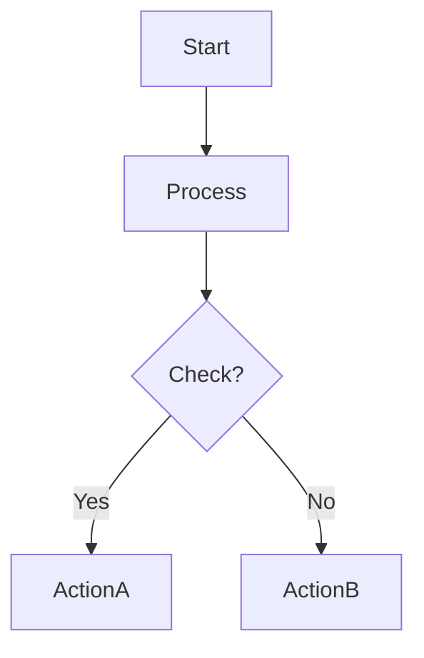

**Direction options**: `TD` (top-down), `LR` (left-right), `BT` (bottom-top), `RL` (right-left)

### 2. Sequence Diagram
**Use for**: API interactions, system communications, time-based flows

**Syntax**:
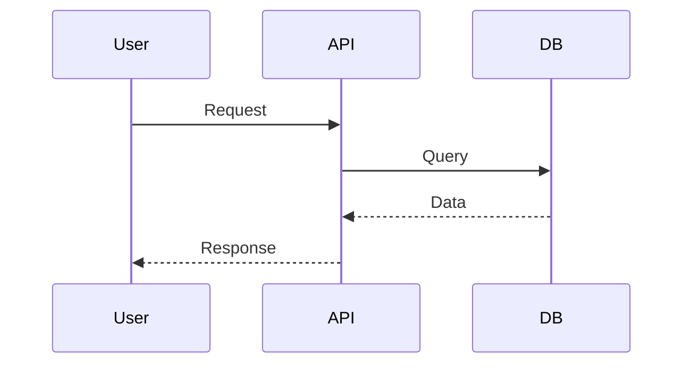

### 3. Class Diagram
**Use for**: Object-oriented design, data models, entity relationships

**Syntax**:
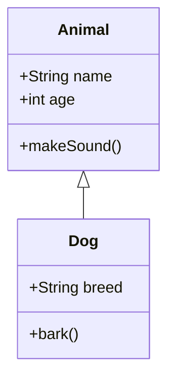

### 4. State Diagram
**Use for**: State machines, workflow states, status transitions

**Syntax**:
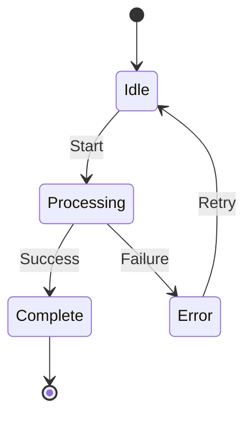

### 5. Entity Relationship Diagram
**Use for**: Database schemas, data relationships

**Syntax**:
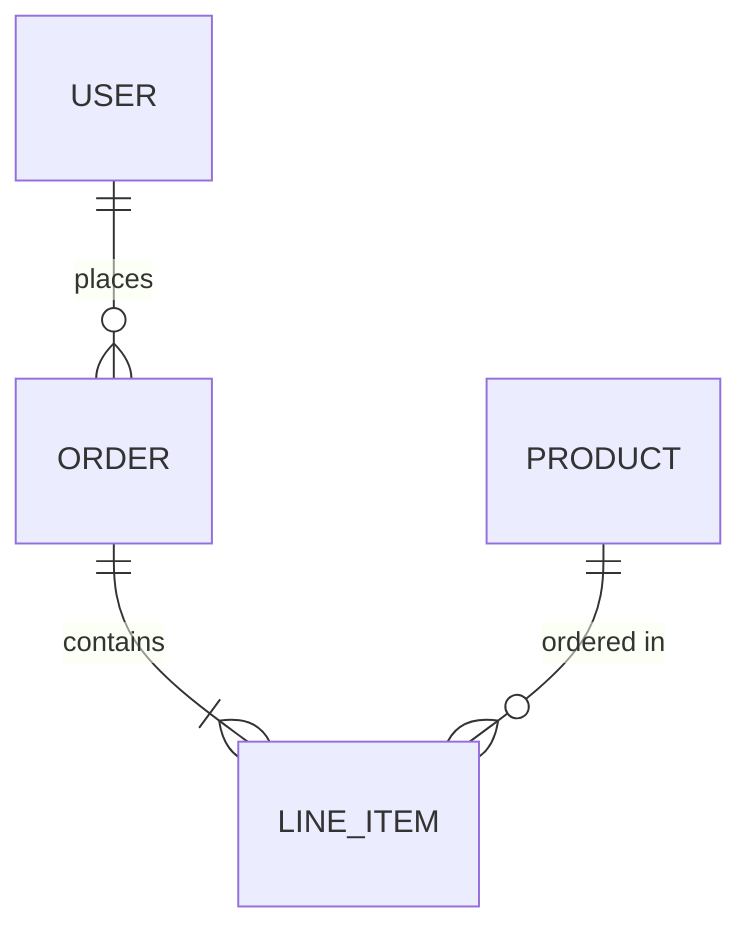

### 6. Gantt Chart
**Use for**: Project timelines, task scheduling

**Syntax**:
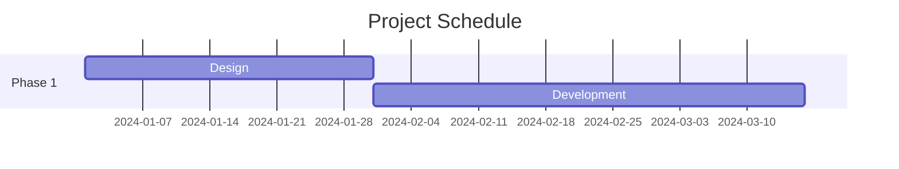

### 7. Pie Chart
**Use for**: Data distribution, proportions

**Syntax**:
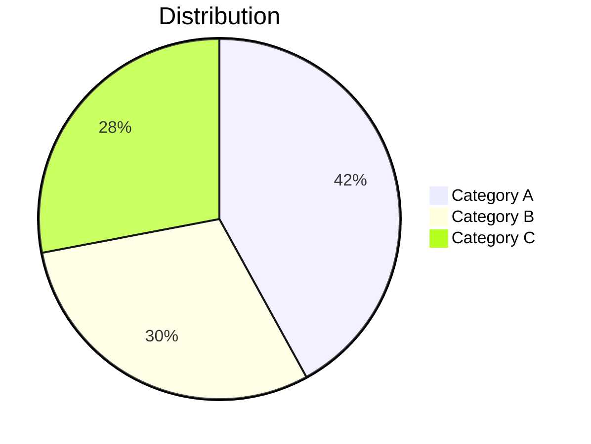

## Complete Example

### User Request
"Show me how user authentication works in a typical web application."

### Response Workflow

**Step 1**: Generate sequence diagram code

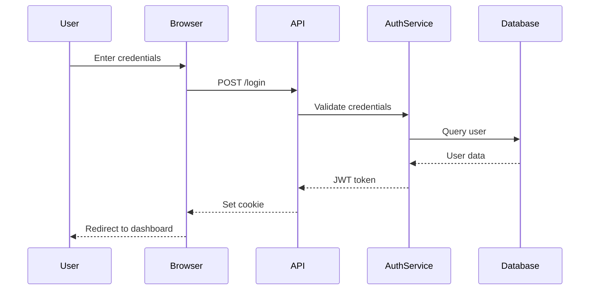

**Step 2**: Write to file
```bash
# Get timestamp
timestamp=$(date +%s)
```
[Use Write tool to create `/tmp/mermaid-diagram-${timestamp}.mmd` with the Mermaid code]

**Step 3**: Render to PNG
```bash
mmdc -i /tmp/mermaid-diagram-1706382451.mmd -o /tmp/mermaid-diagram-1706382451.png -b transparent
```

**Step 4**: Open image
```bash
open /tmp/mermaid-diagram-1706382451.png
```

**Step 5**: Inform user
```
I've created a sequence diagram showing the authentication flow and opened it in your default image viewer. The diagram illustrates the interaction between the user, browser, API, authentication service, and database during the login process.

Diagram saved to: /tmp/mermaid-diagram-1706382451.png
```

## Tips for Better Diagrams

### Labels and Formatting
- Use quotes for labels with spaces: `A["User Input"]`
- Use different node shapes:
  - `[Rectangle]` - standard process
  - `(Rounded)` - start/end points
  - `{Diamond}` - decisions
  - `[[Subroutine]]` - predefined process
  - `[(Database)]` - data storage

### Styling (Optional)
Add custom styles for emphasis:
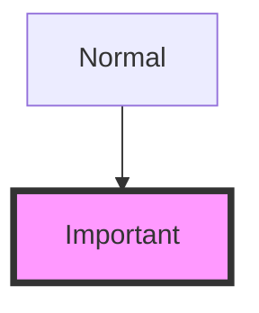

### Subgraphs
Organize complex diagrams:
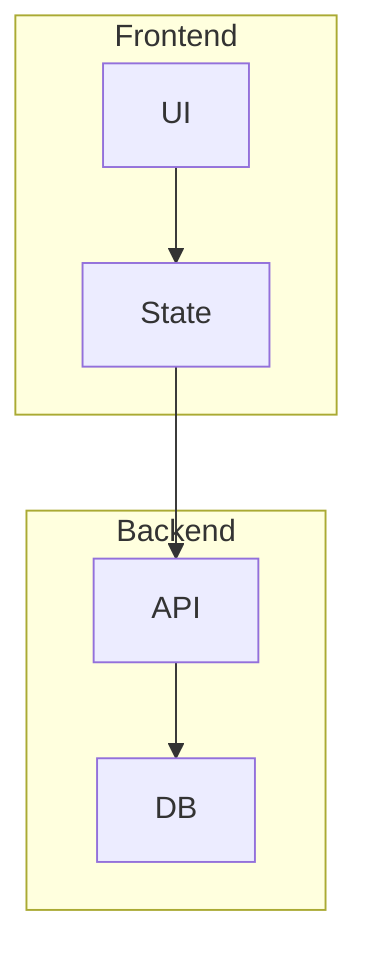

## Troubleshooting

| Issue | Solution |
|-------|----------|
| Diagram too small | Use `-w 1600 -s 2` for higher resolution |
| Text overlapping | Shorten labels or use abbreviations |
| Layout looks wrong | Try different direction (TD vs LR) or restructure nodes |
| Dark theme issue | Use `-b white` or `-b black` instead of transparent |
| Complex diagram unreadable | Split into multiple smaller diagrams |

## Reference

- **Mermaid Documentation**: https://mermaid.js.org/
- **Live Editor**: https://mermaid.live (for testing syntax)
- **CLI Documentation**: https://github.com/mermaid-js/mermaid-cli

---

**Remember**: The goal is clarity. If a diagram becomes too complex, simplify it or split it into multiple focused diagrams.
