# Mermaid Diagram Display

Display Mermaid diagrams as high-quality PNG images that automatically open in your default image viewer. This provides clear, professional visualization for flowcharts, sequence diagrams, class diagrams, and more.

## When to Use

Use this skill when:
- User requests visual diagrams (flowcharts, sequence diagrams, architecture diagrams, etc.)
- Explaining system architecture, data flows, or process workflows
- Complex relationships are better shown graphically than in text
- Creating documentation that benefits from visual aids
- Designing state machines, API interactions, or database schemas

Do NOT use when:
- Simple text descriptions are sufficient
- User explicitly prefers text-only output
- Diagram would be trivial (2-3 simple nodes with obvious relationships)

## Prerequisites

**No installation required!** This skill automatically uses mermaid-cli via `npx`.

**Requirements**: Only npm/Node.js (which you likely already have)

**Optional: Install for faster execution**
If you frequently create diagrams, install mermaid-cli globally for instant execution:

```bash
npm install -g @mermaid-js/mermaid-cli
```

**Tool selection priority**:
1. `mmdc` (if installed) - Fastest (~50ms)
2. `npx -y @mermaid-js/mermaid-cli` (fallback) - Universal compatibility (~300ms after cache)

## Configuration

Customize diagram rendering with environment variables:

**Available options**:
```bash
# Theme (default, forest, dark, neutral)
export MERMAID_THEME=dark

# Background color (transparent, white, black, #HEX)
export MERMAID_BG=transparent

# Custom config file path (optional)
export MERMAID_CONFIG=~/.config/mermaid/config.json

# Size and scale (optional)
export MERMAID_WIDTH=1200
export MERMAID_HEIGHT=800
export MERMAID_SCALE=2
```

**Usage examples**:

One-time use:
```bash
MERMAID_THEME=dark claude
```

Persistent (add to ~/.zshrc or ~/.bashrc):
```bash
export MERMAID_THEME=dark
export MERMAID_BG=transparent
```

Project-specific (.env file):
```bash
# .env
MERMAID_THEME=dark
MERMAID_CONFIG=./mermaid.config.json
MERMAID_WIDTH=1200
```

## Workflow

### Step 1: Generate Mermaid Code

Based on user requirements, create valid Mermaid syntax. Choose the appropriate diagram type:

**Flowchart (Process flows, algorithms)**:


**Sequence Diagram (API interactions, communications)**:
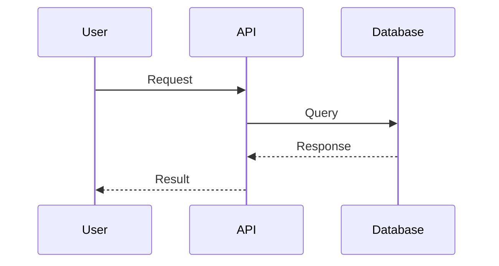

**Class Diagram (Object-oriented design)**:
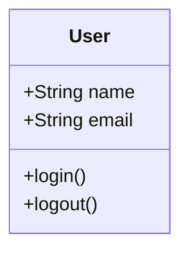

### Step 2: Save to Temporary File

Use Write tool to create a temporary Mermaid file with timestamp to avoid conflicts:

**File path pattern**: `/tmp/mermaid-diagram-{unix-timestamp}.mmd`

**Example**:
```
/tmp/mermaid-diagram-1706382451.mmd
```

Use `date +%s` in bash to get current Unix timestamp, or use a descriptive name if the diagram has specific context.

### Step 3: Render to PNG

Use Bash tool to convert Mermaid to PNG. The skill automatically selects the best available tool and applies user configuration:

```bash
# Smart tool selection
if command -v mmdc &> /dev/null; then
    MERMAID_CMD="mmdc"
elif command -v npx &> /dev/null; then
    MERMAID_CMD="npx -y @mermaid-js/mermaid-cli"
else
    echo "Error: No mermaid renderer available. Install npm or mermaid-cli."
    exit 1
fi

# Load configuration from environment variables (with defaults)
MERMAID_THEME=${MERMAID_THEME:-default}
MERMAID_BG=${MERMAID_BG:-transparent}
MERMAID_CONFIG=${MERMAID_CONFIG:-}
MERMAID_WIDTH=${MERMAID_WIDTH:-}
MERMAID_HEIGHT=${MERMAID_HEIGHT:-}
MERMAID_SCALE=${MERMAID_SCALE:-}

# Render diagram with configuration
$MERMAID_CMD \
  -i /tmp/mermaid-diagram-{timestamp}.mmd \
  -o /tmp/mermaid-diagram-{timestamp}.png \
  -t "$MERMAID_THEME" \
  -b "$MERMAID_BG" \
  ${MERMAID_CONFIG:+-c "$MERMAID_CONFIG"} \
  ${MERMAID_WIDTH:+-w "$MERMAID_WIDTH"} \
  ${MERMAID_HEIGHT:+-H "$MERMAID_HEIGHT"} \
  ${MERMAID_SCALE:+-s "$MERMAID_SCALE"}
```

**Core Parameters** (always applied):
- `-i`: Input Mermaid file path
- `-o`: Output PNG file path
- `-t`: Theme (env: `MERMAID_THEME`, default: `default`)
- `-b`: Background color (env: `MERMAID_BG`, default: `transparent`)

**Optional Parameters** (applied if env var is set):
- `-c`: Config file path (env: `MERMAID_CONFIG`)
- `-w`: Width in pixels (env: `MERMAID_WIDTH`)
- `-H`: Height in pixels (env: `MERMAID_HEIGHT`)
- `-s`: Scale factor (env: `MERMAID_SCALE`)

**First-time execution with npx**: Will automatically download and cache mermaid-cli (~100MB, 10-20 seconds). Subsequent runs use the cached version and complete in ~300ms

### Step 4: Open Image in Default Viewer

Use Bash tool to open the PNG file with macOS `open` command:

```bash
open /tmp/mermaid-diagram-{timestamp}.png
```

The image will automatically open in the user's default image viewer (Preview, Photos, etc.).

### Step 5: Inform User

Let the user know the diagram has been opened:

```
I've generated and opened the [diagram type] in your default image viewer.
```

Optionally provide the file path so they can reference it later:

```
The diagram has been saved to: /tmp/mermaid-diagram-{timestamp}.png
```

### Step 6: Cleanup (Optional)

The files are in `/tmp` and will be automatically cleaned by the system, but you can provide cleanup instructions if requested:

```bash
rm /tmp/mermaid-diagram-{timestamp}.mmd /tmp/mermaid-diagram-{timestamp}.png
```

## Error Handling

### No Renderer Available

If all rendering methods fail:
```
Error: No mermaid renderer available.

Solutions:
1. Install Node.js (includes npm): brew install node
2. Install mermaid-cli globally: npm install -g @mermaid-js/mermaid-cli

Either option will enable diagram rendering.
```

### Slow First Execution

If first execution takes 10-20 seconds:
- **Cause**: npx downloading mermaid-cli (~100MB) on first use
- **Solution**: This only happens once. Package is cached for future use (~300ms after cache)
- **Optional**: Install globally for instant execution: `npm install -g @mermaid-js/mermaid-cli`

### Invalid Mermaid Syntax

If rendering fails due to syntax errors:
1. Check Mermaid syntax validity
2. Provide corrected syntax to user
3. Suggest testing at https://mermaid.live

### Configuration Not Working

If environment variables are not applied:
- **Cause**: Variables not exported or Claude not restarted
- **Solution**:
  1. Verify: `echo $MERMAID_THEME` (should show your value)
  2. Export: `export MERMAID_THEME=dark` (for current session)
  3. Persistent: Add to `~/.zshrc` or `~/.bashrc` and restart terminal

### File Permission Issues

If write/read fails:

```bash
# Ensure /tmp is writable
ls -ld /tmp

# Use alternative location if needed
~/Downloads/mermaid-diagram-{timestamp}.mmd
```

## Best Practices

### DO ✓

- Use descriptive node labels (e.g., "User Authentication" not "Auth")
- Keep diagrams focused: 5-15 nodes is optimal for readability
- Choose the right diagram type for the content:
  - Flowchart: Process flows, decision trees
  - Sequence: Time-based interactions, API calls
  - Class: Object structure, data models
  - State: State machines, workflows
  - ER: Database schemas
- Use transparent background (`-b transparent`) for versatility
- Include meaningful arrows labels for decision branches
- Use subgraphs to organize complex flowcharts

### DON'T ✗

- Create overly complex diagrams (>20 nodes) - split into multiple diagrams instead
- Use very long text in node labels (breaks layout) - keep labels under 30 characters
- Skip error checking for tool availability
- Use spaces in node IDs (use camelCase or underscores)
- Force diagrams when simple text would be clearer
- Mix diagram types in a single chart

## Common Diagram Types

### 1. Flowchart / Graph
**Use for**: Process flows, decision trees, algorithms, workflows

**Syntax**:
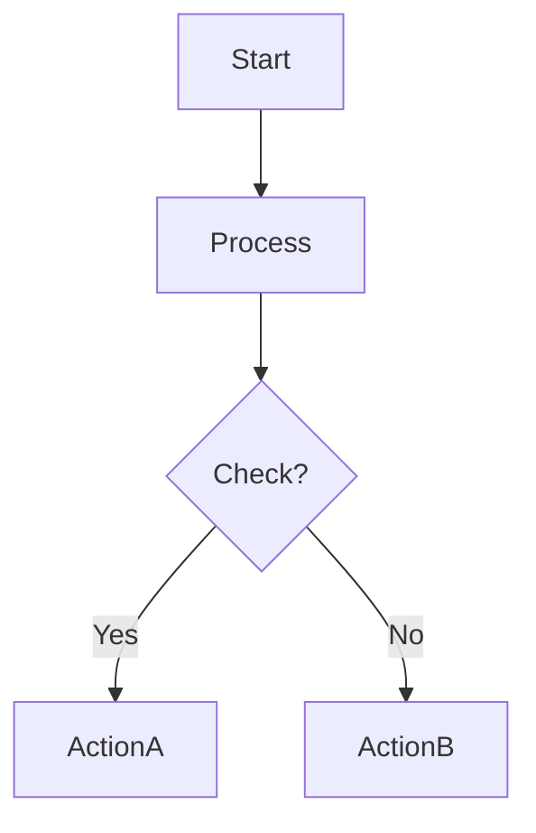

**Direction options**: `TD` (top-down), `LR` (left-right), `BT` (bottom-top), `RL` (right-left)

### 2. Sequence Diagram
**Use for**: API interactions, system communications, time-based flows

**Syntax**:
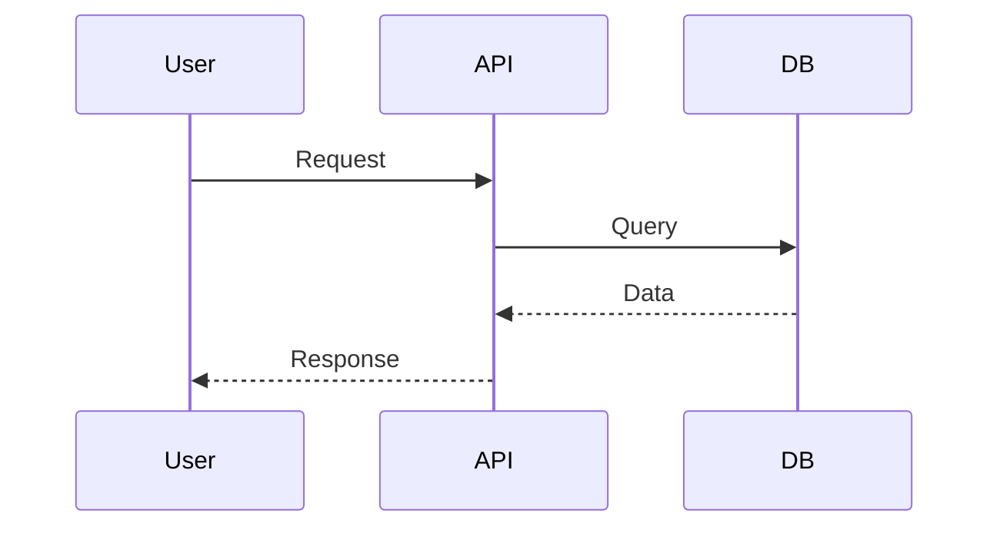

### 3. Class Diagram
**Use for**: Object-oriented design, data models, entity relationships

**Syntax**:
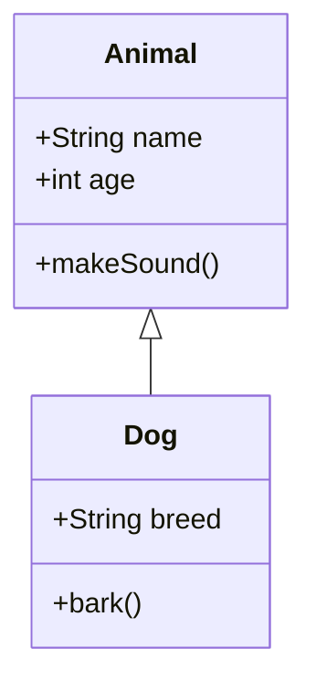

### 4. State Diagram
**Use for**: State machines, workflow states, status transitions

**Syntax**:
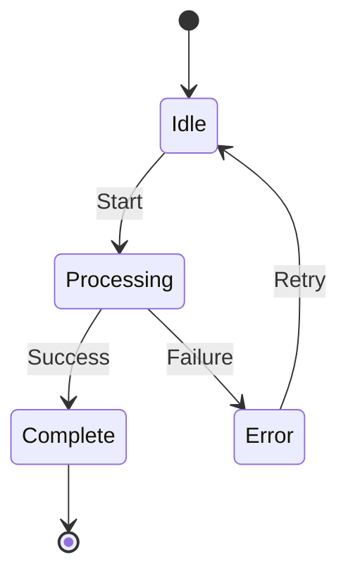

### 5. Entity Relationship Diagram
**Use for**: Database schemas, data relationships

**Syntax**:
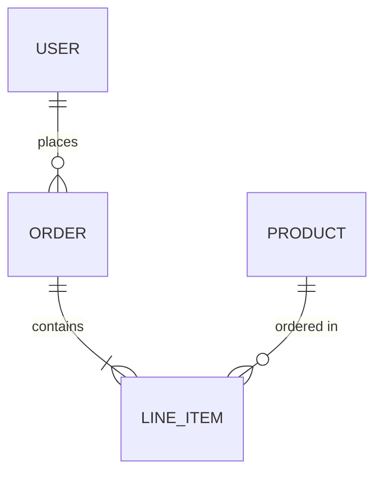

### 6. Gantt Chart
**Use for**: Project timelines, task scheduling

**Syntax**:
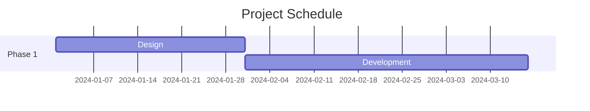

### 7. Pie Chart
**Use for**: Data distribution, proportions

**Syntax**:
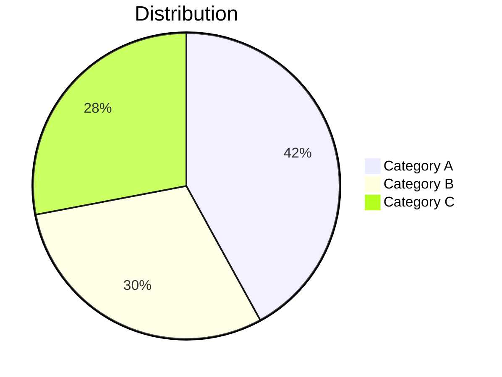

## Complete Example

### User Request
"Show me how user authentication works in a typical web application."

### Response Workflow

**Step 1**: Generate sequence diagram code

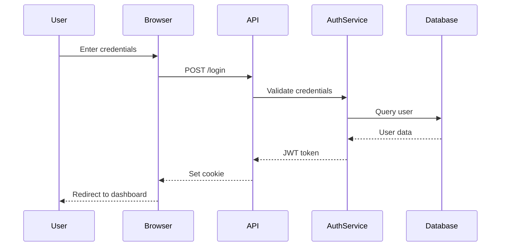

**Step 2**: Write to file
```bash
# Get timestamp
timestamp=$(date +%s)
```
[Use Write tool to create `/tmp/mermaid-diagram-${timestamp}.mmd` with the Mermaid code]

**Step 3**: Render to PNG
```bash
# Using the automatic tool selection from Step 3, which resolves to:
# mmdc ... (if installed), or
# npx -y @mermaid-js/mermaid-cli ... (fallback)
mmdc -i /tmp/mermaid-diagram-1706382451.mmd -o /tmp/mermaid-diagram-1706382451.png -t default -b transparent
```

**Step 4**: Open image
```bash
open /tmp/mermaid-diagram-1706382451.png
```

**Step 5**: Inform user
```
I've created a sequence diagram showing the authentication flow and opened it in your default image viewer. The diagram illustrates the interaction between the user, browser, API, authentication service, and database during the login process.

Diagram saved to: /tmp/mermaid-diagram-1706382451.png
```

## Tips for Better Diagrams

### Labels and Formatting
- Use quotes for labels with spaces: `A["User Input"]`
- Use different node shapes:
  - `[Rectangle]` - standard process
  - `(Rounded)` - start/end points
  - `{Diamond}` - decisions
  - `[[Subroutine]]` - predefined process
  - `[(Database)]` - data storage

### Styling (Optional)
Add custom styles for emphasis:
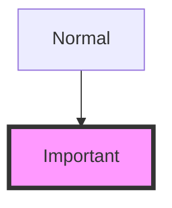

### Subgraphs
Organize complex diagrams:
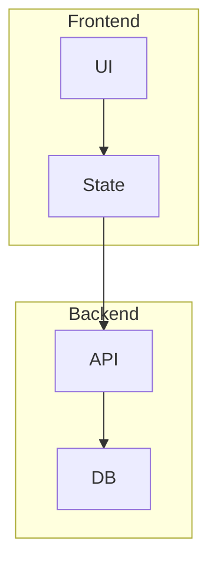

## Troubleshooting

| Issue | Solution |
|-------|----------|
| Diagram too small | Use `-w 1600 -s 2` for higher resolution |
| Text overlapping | Shorten labels or use abbreviations |
| Layout looks wrong | Try different direction (TD vs LR) or restructure nodes |
| Dark theme issue | Use `-b white` or `-b black` instead of transparent |
| Complex diagram unreadable | Split into multiple smaller diagrams |

## Reference

- **Mermaid Documentation**: https://mermaid.js.org/
- **Live Editor**: https://mermaid.live (for testing syntax)
- **CLI Documentation**: https://github.com/mermaid-js/mermaid-cli

---

**Remember**: The goal is clarity. If a diagram becomes too complex, simplify it or split it into multiple focused diagrams.
