# Agent-First Programming Workflow

## Overview

This document defines the **Agent-First** human-agent collaborative development workflow based on Claude Code. The core principle: **Agents handle complex automation**, **Commands are used only at critical decision points**, ensuring efficiency, quality, and traceability.

## Core Principles

1. **Agent-First**: Agents autonomously execute complex tasks, humans focus on critical decisions
2. **Simplified Structure**: Minimalist local workspace, easy to maintain and clean
3. **Standard Communication**: Standardized data exchange via JSON + Markdown
4. **Fibonacci Complexity**: Complexity estimation based on token consumption, not human hours
5. **Continuous Improvement**: Retro Agent analyzes estimation accuracy and optimizes future predictions

## Workflow Architecture


### Initialization Workflow

The `/init-agents` command sets up the agent workspace and optionally performs project audits:

```mermaid
graph TB
    Start([/init-agents Command])

    Start --> CreateStructure[Create .agents/ Structure]
    CreateStructure --> ConfigPkgMgr[Configure Package Manager<br/>npm/pnpm/bun]
    ConfigPkgMgr --> ConfigTask[Configure Task Management<br/>Linear/GitHub/Jira/Local]

    ConfigTask --> AskDoc{Ask: Run @agent-doc<br/>documentation audit?}
    AskDoc -->|Yes| DocAudit[@agent-doc<br/>Audit Project Documentation]
    AskDoc -->|No| AskDevOps
    DocAudit --> DocReport[Generate:<br/>- Documentation inventory<br/>- Missing docs list<br/>- Improvement plan<br/>- Completeness score]

    DocReport --> AskDevOps{Ask: Run @agent-devops<br/>infrastructure audit?}
    AskDevOps -->|Yes| DevOpsAudit[@agent-devops<br/>Audit Infrastructure/Environment]
    AskDevOps -->|No| Complete

    DevOpsAudit --> DevOpsReport[Generate:<br/>- Infrastructure inventory<br/>- Missing configs list<br/>- Improvement plan<br/>- Readiness score]

    DevOpsReport --> Complete[Initialization Complete<br/>Workspace Ready]

    classDef commandClass fill:#E1F5FE,stroke:#0288D1,stroke-width:2px
    classDef agentClass fill:#E8F5E9,stroke:#2E7D32,stroke-width:2px
    classDef decisionClass fill:#FFF9C4,stroke:#F57C00,stroke-width:2px
    classDef outputClass fill:#F3E5F5,stroke:#6A1B9A,stroke-width:2px

    class Start commandClass
    class DocAudit,DevOpsAudit agentClass
    class AskDoc,AskDevOps decisionClass
    class DocReport,DevOpsReport,CreateStructure,ConfigPkgMgr,ConfigTask,Complete outputClass
```

**Key Points:**
- Audits are **optional** during initialization
- Documentation audit checks project-wide doc status (Trigger 2 for @agent-doc)
- Infrastructure audit checks environment and deployment readiness (Trigger 3 for @agent-devops)
- For Jira projects: ACLI (Atlassian CLI) is installed and OAuth-authenticated during initialization
- See `commands/init-agents.md` for detailed initialization steps

## Agent Local Workspace

### Quick Start

```bash
# Initialize workspace
/init-agents

# Detailed guide
See: commands/init-agents.md
```

### Workspace Structure Overview

```
.agents/
├── tasks/          # Task state (JSON + markdown)
├── retro/          # Retrospective analysis
├── states.yml      # State definitions
├── lib.js          # Helper library
└── README.md       # Usage guide
```

**Detailed Technical Guide**: See @~/.claude/agent-workspace-guide.md

### Core Concepts

- **Fibonacci Complexity**: 1, 2, 3, 5, 8, 13... (1 point = 1000 tokens)
- **State Management**: states.yml is the single source of truth
- **Auto Cleanup**: Based on file mtime, deleted after 90 days
- **Agent Communication**: JSON task state + Markdown detailed content

## Commands Layer (Critical Decision Points)

### 1. `/po` - Product Requirements Definition
**When to use**: Project start or new feature planning
**You decide**: Core feature scope, acceptance criteria, priorities
**Then auto**: `@agent-planner` automatically breaks down tasks

### 2. `/techlead` - Technical Architecture Decisions
**When to use**: Major technology selection or architecture changes
**You decide**: Tech stack, architecture patterns, risk assessment
**Then auto**: `@agent-planner` refines tasks based on architecture

### 3. `/approve` - Review Important Changes
**When to use**: API changes, schema changes, major refactoring
**You decide**: Approve or request modifications
**Then auto**: `@agent-reviewer` completes commit

### 4. `/git-commit` - Manual Git Commit
**When to use**: Emergency fixes or special commits
**You decide**: Commit timing and message

### 5. `/init-agents` - Initialize Agent Workspace
**When to use**: New project start
**Execution**: Create `.agents/` structure, state definitions, helper library

## Agents Layer (Autonomous Execution)

### Core Agents

| Agent | Responsibility | Input | Output | Handoff To |
|-------|---------------|-------|--------|-----------|
| `@agent-planner` | Task breakdown, PRD generation | Requirements | planner.md | @agent-coder |
| `@agent-coder` | TDD implementation | PRD | coder.md | @agent-reviewer |
| `@agent-reviewer` | Quality review + **Git commit** | Code | reviewer.md | **@agent-pm** |
| `@agent-pm` | **Completion workflow**: Retro + Report | Commit info | Completion report | User |
| `@agent-retro` | Retrospective analysis | Completed task | Estimation insights | @agent-pm |
| `@agent-debugger` | Error diagnosis & fix | Error info | debugger.md | @agent-coder |
| `@agent-optimizer` | Performance optimization | Code | optimizer.md | @agent-reviewer |
| `@agent-doc` | Documentation generation | Code | Documentation | @agent-devops (optional) |
| `@agent-devops` | Deployment configuration | Application | Deploy config | @agent-reviewer (optional) |

**Note on Standard Review Completion:**
- After code changes: `@agent-reviewer` → `@agent-doc` (mandatory for code changes)
- After documentation: `@agent-doc` → `@agent-devops` (optional if infrastructure changes)
- After infrastructure: `@agent-devops` → `@agent-reviewer` (optional if config changes)
- Doc and DevOps agents are part of standard review completion workflow, not separate branches

### Agent Trigger Mechanisms

#### @agent-doc Trigger Modes

The documentation agent supports two distinct triggering scenarios:

**Trigger 1: Post-Review (Code Change Documentation)**
- **When**: After `@agent-reviewer` completes code review
- **Purpose**: Generate documentation for new or modified code
- **Handoff**: Manually or automatically invoked from reviewer
- **Outputs**: API docs, code comments, README updates, architecture docs

**Trigger 2: Post-Init Audit (Project-Wide Documentation Inventory)**
- **When**: After `/init-agents` execution, optionally invoked
- **Purpose**: Comprehensive documentation status audit across entire project
- **Invocation**: User chooses to run documentation audit during initialization
- **Outputs**: Documentation inventory report, missing docs list, improvement plan, completeness score

For complete details on dual-trigger mechanism, see `agents/doc.md`.

#### @agent-devops Trigger Modes

The DevOps agent supports three distinct triggering scenarios:

**Trigger 1: Post-Doc (Optional Infrastructure Support)**
- **When**: After `@agent-doc` completes, if infrastructure changes needed
- **Purpose**: Create/update deployment and infrastructure configuration
- **Handoff**: Optional handoff from doc agent
- **Outputs**: CI/CD pipelines, IaC configs, container configs, monitoring setup

**Trigger 2: Infrastructure-Focused Task**
- **When**: Task itself relates to infrastructure (not product development)
- **Purpose**: Direct infrastructure work (e.g., "Setup staging environment")
- **Invocation**: Directly assigned without prior agent handoff
- **Outputs**: Environment setup, pipeline improvements, infrastructure automation

**Trigger 3: Post-Init Audit (Infrastructure Inventory)**
- **When**: After `/init-agents` execution, optionally invoked
- **Purpose**: Comprehensive infrastructure and environment status audit
- **Invocation**: User chooses to run infrastructure audit during initialization
- **Outputs**: Infrastructure inventory report, missing configs list, improvement plan, readiness score

For complete details on triple-trigger mechanism, see `agents/devops.md`.

### Agent Operation Example

```javascript
const { AgentTask } = require('./.agents/lib');

// Planner: Create task
const task = AgentTask.create('LIN-123', 'Implement auth API', 8);
task.writeAgentOutput('planner', '# PRD...');
task.updateAgent('planner', { status: 'completed', handoff_to: 'coder' });

// Coder: Take over task
const myTasks = AgentTask.findMyTasks('coder');
task.updateAgent('coder', { status: 'working' });

// Reviewer: Review and commit
task.updateAgent('reviewer', { status: 'completed', handoff_to: 'pm' });

// PM: Task completion workflow
// 1. Trigger retro
// 2. Generate report
// 3. Update Linear
// 4. Report to user

// Reviewer: Complete task
task.complete();  // Auto calculate actual complexity
```

**Complete API Documentation**: See [agent-workspace-guide.md](./agent-workspace-guide.md#agent-工作流程範例)

## Workflow Examples

### Example 1: Standard Development Flow (with Task Completion)

```bash
# Step 1: Define requirements (human)
/po "Implement user authentication system"

# Step 2: Architecture decisions (human)
/techlead [Choose JWT + PostgreSQL]

# Step 3-N: Fully automated
# @agent-planner breaks down tasks (LIN-123) →
# @agent-coder implements →
# @agent-reviewer reviews + commits →
# @agent-pm receives handoff:
#   1. Triggers @agent-retro analyze LIN-123
#   2. Generates completion report
#   3. Updates Linear issue to Done
#   4. Reports to user with retro insights
```

### Example 2: Requires Human Review

```bash
# Agents execute automatically
@agent-coder "Modify User API schema"

# System prompt: Important changes need review
/approve [Review changes]

# Auto commit after approval
```

### Example 3: Error Diagnosis

```bash
# Fully automated
@agent-debugger "Fix login 500 error"
# → @agent-coder auto fixes
# → @agent-reviewer reviews + commits
```

### Example 4: Task Completion Workflow (Automatic)

```bash
# After @agent-reviewer commits code:
#
# @agent-reviewer → handoff to @agent-pm
#
# @agent-pm automatically:
# 1. Calls @agent-retro analyze LIN-123
#    Output:
#    - Estimation accuracy: 78%
#    - Actual complexity: 10 (estimated 8)
#    - Token usage: 8500 (estimated 8000)
#    - Lessons: Authentication logic more complex than expected
#
# 2. Generates completion report for user:
#    ✅ Task LIN-123 completed
#    📊 Retro: 78% estimation accuracy
#    💡 Insight: Add 20% buffer for auth tasks
#    🔗 Linear updated to Done
#
# 3. Waits for user acknowledgment
# - Recommendation: Add +2 complexity for Auth tasks
```

## Agent Failure Protection

### Auto Escalation Flow

```mermaid
graph TB
    Agent[Agent Execution]
    Detect{Check Status}

    Detect -->|Success| Success[✅ Complete]
    Detect -->|Failure| Classify{Error Classification}

    Classify -->|Transient| Retry[Retry < 3 times]
    Classify -->|Strategic| Fallback[Fallback < 2 times]
    Classify -->|Architectural| Escalate[🚨 Escalate to Human]

    Retry -->|Limit reached| Escalate
    Fallback -->|Limit reached| Escalate

    Escalate --> Save[💾 Save State]
    Save --> Wait[⏸️ Wait for Instructions]

    classDef successClass fill:#C8E6C9
    classDef escalateClass fill:#FFCDD2

    class Success successClass
    class Escalate,Save,Wait escalateClass
```



### Escalation Triggers

- ❌ Same error retried ≥ 3 times
- ⏱️ Execution time exceeds expected by 3x
- 💾 Resource usage anomaly (Memory >80%, CPU >90%)
- 🚨 Architecture/security issues escalate immediately

### Escalation Notification Format

```markdown
🚨 **Agent Needs Human Assistance**

**Agent**: @agent-coder
**Task**: LIN-123
**Status**: ⏸️ Paused

**Issue**: Test failures after 3 retries

**Current State**:
- ✅ Saved: stash@{0}
- ✅ Diagnosis: .agents/tasks/LIN-123/coder.md
- ✅ Task marked: BLOCKED

**Options**:
A) View failure reasons
B) Take over and fix directly
C) Adjust requirements
```

## Data Cleanup Mechanism

### Auto Cleanup (File mtime-based)

```javascript
// Cleanup tasks completed 90 days ago
const { AgentTask } = require('./.agents/lib');

const cleaned = AgentTask.cleanup(90);
console.log(`Cleaned ${cleaned} old tasks`);

// Periodic execution (cron)
// 0 2 * * * cd /path/to/project && node -e "require('./.agents/lib').AgentTask.cleanup(90)"
```

### Cleanup Rules

- ✅ Only cleanup `completed` or `cancelled` status
- ✅ Determine age based on file `mtime`
- ✅ Delete both JSON and corresponding folders
- ✅ No archive folder needed

## Git Version Control

### Commit Authority Control

**✅ Has Commit Authority**:
1. `@agent-reviewer` - Auto commit after review passes
2. `/git-commit` - Human manual commit

**❌ No Commit Authority**:
- `@agent-coder`
- `@agent-planner`
- All other agents

### Commit Format

```bash
# Conventional Commits
<type>[optional scope]: <description>

# Examples
feat(LIN-123): implement JWT token service
fix(LIN-124): resolve login timeout issue
docs: update API documentation

# Auto-added
🤖 Generated with [Claude Code](https://claude.com/claude-code)

Co-Authored-By: Claude <noreply@anthropic.com>
```

## Best Practices

### 1. Agent-First Priority

- ✅ Complex tasks → Use Agents
- ✅ Automation work → Use Agents
- ⚠️ Critical decisions → Use Commands

### 2. Task Complexity Estimation

- Based on token consumption, not human hours
- Use Fibonacci sequence: 1, 2, 3, 5, 8, 13...
- Continuously optimized by `@agent-retro`

### 3. Keep Workspace Clean

```bash
# Periodic cleanup
AgentTask.cleanup(90);

# Check workspace size
du -sh .agents/

# View active tasks
ls .agents/tasks/*.json | wc -l
```

### 4. Monitor Agent Status

```bash
# View task status
cat .agents/tasks/LIN-123.json | jq

# View Agent output
cat .agents/tasks/LIN-123/coder.md

# View retro analysis
cat .agents/retro/*.md
```

## Workflow Improvement Log

### ✅ Completed

- [x] Simplified to 4 key Commands
- [x] Agents handle all complex work
- [x] Minimalist local workspace architecture
- [x] Fibonacci complexity estimation mechanism
- [x] Retro Agent retrospective analysis
- [x] File time-based automatic cleanup
- [x] State definition file (states.yml)
- [x] Agent helper library (lib.js)
- [x] `/init-agents` initialization command

### 📋 To Implement

- [ ] Implement `@agent-planner`
- [ ] Implement `@agent-doc`
- [ ] Implement `@agent-devops`
- [ ] Implement `@agent-retro`
- [ ] Implement `/approve` command
- [ ] Update all Agents to use new workspace
- [ ] Create usage example project
- [ ] Collect usage feedback and optimize

## References

- @~/.claude/CLAUDE.md - Global configuration
- @~/.claude/commands/ - Commands definitions
- @~/.claude/agents/ - Agents specifications
- @~/.claude/agent-workspace-guide.md - Workspace detailed guide
- @~/.claude/commands/init-agents.md - Initialization command

---

**Last Updated**: 2025-10-02
**Version**: 2.0 - Agent-First
**Status**: Active Development
