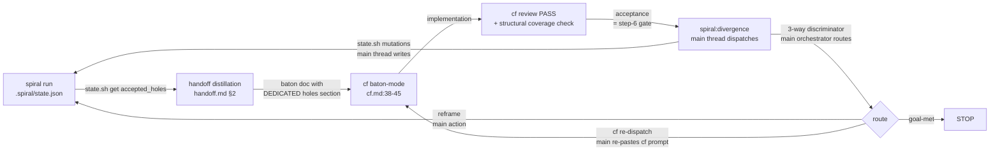

# Spiral ↔ Context-Flow Integration: Correction Direction

This document names five concrete defects in the current spiral→cf round-trip design and
specifies the correction for each. Citations are pinned to actual file:line locations in the
repo. Defect 1 is the real bug; 2 and 3 are honesty/constraint corrections; 4 and 5 are
design decisions that the round-trip needs to be determinate.

**Citation paths (H-C — plugin-relative, resolving the path-bare ambiguity).** The two plugins
own distinctly-named files; bare basenames in this doc resolve as follows. cf is a SEPARATE plugin
(this distinction is the root of defect H-A):

| Bare name in this doc | Plugin-relative path |
|---|---|
| `handoff.md` | `spiral/commands/handoff.md` |
| `spiral.md` | `spiral/commands/spiral.md` |
| `divergence.md` | `spiral/agents/divergence.md` |
| `convergence.md` | `spiral/agents/convergence.md` |
| `state.sh` | `spiral/scripts/state.sh` (invoked as `${CLAUDE_PLUGIN_ROOT}/scripts/state.sh`) |
| `cf.md` | `context-flow/commands/cf.md` (the OTHER plugin — no access to spiral's `state.json`/`state.sh`) |

Sections H5, E1 hop 2/4, E7, and H-B below use the full plugin-relative form inline; the older
sections' bare basenames resolve via this table.

---

## The Round-Trip at a Glance

The loop state lives in `.spiral/state.json` (mutated only via `state.sh`) plus the baton
document and `.spiral/handoff-pilot-notes.md`. These survive a context reset; no agent's
live context is the authority for loop state.

---

## E1 — accepted_holes Must Ride the Baton (DEFECT 1: the real bug)

**What is broken.** The current `handoff.md §4b` acceptance step (handoff.md:62-81) passes
only the original goal and frozen Examples to divergence. It does not carry `accepted_holes`
forward. When divergence encounters a still-open hole that was accepted and parked in a prior
spiral turn, it has no way to distinguish it from a fresh ship-blocking defect — so it can
flag it as a blocker, and the loop can never reach goal-met on a goal that has any parked
holes.

**Carrier trace — four hops.**

1. **Leaves state.json** via `state.sh get accepted_holes` (state.sh:86-87). The
   `accepted_holes` array is a required typed core field (state.sh:19, 44).

2. **A DEDICATED baton section, which is a regenerated view (not a frozen snapshot).** The
   handoff distillation (`spiral/commands/handoff.md:36-37`, the "Holes ledger" section, item 3)
   becomes the explicit carrier. This section is a SEPARATE section in the baton document —
   option A — and is NOT folded into the "Unverified assumptions" tripwire section
   (`spiral/commands/handoff.md:38-39`, item 4). The tripwire path (`context-flow/commands/cf.md:41`,
   "every assumption the baton flags as unverified must carry over into the plan's Unresolved as a
   tripwire") is for epistemic unknowns, not for consciously accepted design trade-offs. Conflating
   them would make a parked hole trigger a cf NEEDS_REPLAN for something spiral already decided to
   accept.

   **EX5 reconciliation (carrier-framing supersession).** An earlier framing in this design treated
   the baton holes ledger as a one-time "turn-1 snapshot" of `accepted_holes` (the framing the prior
   H5 leaned on). That is SUPERSEDED by H5's regenerated-view decision: the ledger is re-rendered
   from `state.json` by the relay before every cf re-dispatch (H5, "WHERE the regeneration fires").
   Read every reference to the ledger in E1/E4/E6 as "regenerated view," never "frozen snapshot."
   The carrier is still a baton section that cf alone reads (E1's whole point); it is simply kept
   current rather than captured once.

3. **Consumed by cf baton-mode** (cf.md:38-45). The baton-mode gap-scan and plan phases
   receive the holes ledger as a distinct input. Holes in the ledger are NOT elevated to
   tripwires; they are noted as accepted scope boundaries.

4. **Handed to divergence at acceptance.** The acceptance step in `spiral/commands/handoff.md:62-81`
   currently reads: "Dispatch `spiral:divergence` (opus) with the original goal + frozen Examples."
   The correction adds: "and the carried `accepted_holes` list from `.spiral/state.json`." The
   `accepted_holes` LIST is passed at invocation so divergence knows WHICH holes are accepted — but
   the RULE governing how to treat them is NOT passed per-invocation. Per E7 (this doc), the
   suppression rule lives DURABLY in `spiral/agents/divergence.md:34-38` ("Hold these always"), not
   as an invocation argument. So: the list rides the call; the rule is a standing prompt invariant.
   (This sentence folds E7's correction inline so E1 reads consistently on its own — the earlier
   "passes the rule explicitly" phrasing is removed, not merely footnoted.)

**The suppression rule divergence must apply.** A still-open instance of a carried
`accepted_hole` maps to divergence's PARKABLE arm (divergence.md:22-26: "one that is a cheap
later fix ... is parkable; the human decides stop/go on the ship-blocking ones; the parkable
ones ride along as next-turn candidates"). A carried accepted hole is, by definition, already
classified as parkable by the prior turn's human gate (spiral.md:331-353). It must NOT be
re-raised as a fresh ship-blocking hole. Carrying the holes without this rule does not fix
the defect: divergence would still block the loop on a known-accepted item.

**Files this correction changes/constrains:** handoff.md:62-81 (add accepted_holes to
divergence invocation), handoff.md:27-39 (holes ledger is a dedicated section), cf.md:38-45
(baton-mode consumes holes ledger as a distinct input, not as tripwires).

---

## E2 — Structural Coverage Check Must Be Narrowed (DEFECT 2)

**What is broken.** The handoff/acceptance relay currently has no explicit boundary on what
"sign-off" of cf's plan means. Without a defined scope, any convergence-side check risks
becoming a quality or fitness verdict — which convergence must never render (convergence.md:79-81:
"You do not judge whether the result is good enough or what was really wanted — that is the
independent Divergence motion's job").

**The corrected scope.** The con-side check is scoped to a STRUCTURAL COVERAGE check only:

- `{frozen Examples} ⊆ {plan test cases}`: every frozen Example from `.spiral/state.json`
  maps to at least one test case in cf's plan.
- `{carried holes} ⊆ {plan dispositions}`: every accepted_hole in the baton's holes ledger
  has a corresponding disposition in the plan (noted as accepted boundary, not an open
  unresolved).

Output is binary: **covered** or **not-covered**. There is no quality verdict, no fitness
assessment, and no judgment of whether the plan is good — only whether the structural mapping
is complete. This boundary is required by convergence.md:79-81 ("You do not judge whether
the result is good enough").

**WHO runs it.** The structural coverage check is run by the main orchestrator (main thread)
as a mechanical Examples-vs-plan diff — it is NOT a new convergence dispatch and does NOT add
a second human prompt. The main thread reads the plan file and the frozen Examples, checks
subset membership, and reports covered/not-covered before proceeding. This mirrors the
precondition check printed at handoff.md:14-19 (print location, run by the human / main thread).

**Files this correction changes/constrains:** convergence.md:79-81 (cited as the do-not-judge
invariant that bounds the check), handoff.md (print-only baton-writer; the mechanical
structural check before dispatching divergence is a main-thread action, with no new human gate).

**H3 update — structural coverage is necessary but not sufficient.** The covered/not-covered
check is a prerequisite, not a fitness verdict. Behavioral fitness — whether the plan actually
serves the goal — is assigned SOLELY to divergence at acceptance. The relay MUST NOT emit a
"plan validated", fitness, or quality signal; doing so would violate divergence.md:10 ("a suite
that passes while testing the wrong behavior" is the adversarial case divergence hunts). The
relay's output is the binary covered/not-covered; all fitness judgment belongs to divergence.

---

## E3 — No Subagent Calls Another (DEFECT 3: hard constraint)

**What is broken.** The CC platform enforces a star topology: subagents cannot spawn
subagents or call `Agent()` / `SendMessage` to another subagent (reference:
cc-multiagent-constraints, empirical 2026-06-05). Any proposed control transfer that is an
`Agent()` or `SendMessage` call from within convergence or divergence will fail silently or be
dropped.

**The corrected constraint — explicitly stated.** No subagent calls another. Every
control-transfer in the spiral↔cf round-trip is either:

- (a) A **main-orchestrator action** — the `/spiral` orchestrator or `/spiral:handoff`
  orchestrator dispatches `Agent()` calls as the top-level main thread, never from within a
  subagent role; or
- (b) A **print-don't-run prompt** — the human pastes it, as in handoff.md:51-96 which
  already prints the cf invocation and the acceptance step rather than running them.

Convergence (convergence.md) and divergence (divergence.md) have no `Agent` or `SendMessage`
in their allowed-tools. This is the load-bearing constraint, not a guideline.

**Loop state is durable and main-held.** The authoritative loop state lives in:
- `.spiral/state.json` — mutated only via `state.sh`, survives any context reset
- The baton document (`docs/handoff-*.md`) — written at distillation time, survives resets
- `.spiral/handoff-pilot-notes.md` — accumulates pilot observations across sessions

No agent's live context is the loop state. A context reset does not lose the loop. The
`state.sh` file primitive (state.sh:57-66) writes atomically to disk; every mutation
validates the schema before committing.

**Files this correction changes/constrains:** handoff.md:51-96 (already print-only; confirm
no new `Agent()` calls are added to the acceptance step), spiral.md (the orchestrator is the
only entity dispatching `Agent()` calls — subagent roles never dispatch other agents).

---

## Who is the relay

The relay IS the main orchestrator — the human-driven main thread — NOT handoff.md and NOT
any subagent.

This is a direct star-topology consequence of defect 3. The CC platform enforces a star
topology: no subagent calls another subagent. Every cross-plugin transfer in the spiral↔cf
round-trip is therefore either a main-orchestrator action (the main thread dispatches `Agent()`
calls as the top-level orchestrator) or a print-don't-run prompt that the human runs manually.
No subagent calls another — this is a hard platform constraint, not a guideline.

handoff.md is NOT the relay and does NOT automate the relay. handoff.md is the print-only
baton-writer: it prints prompts and baton content the human then executes or pastes. It does
not dispatch agents, does not regenerate state, and does not loop back to cf on its own.

**Star topology + defect 3 stated plainly.** The star topology (E3, defect 3) means: when cf
returns its result, the main orchestrator (main thread) pastes cf's result back into the spiral
conversation and dispatches divergence. There is no re-dispatch loop back to cf —
handoff.md is the print-only baton-writer; the print location of baton prompts the human runs.
The main thread holds the loop.

**cf→spiral return leg (the V).** The main thread pastes cf's result back and dispatches
spiral:divergence. The main orchestrator executes the 3-way routing (E4) and the
acceptance=step-6 identity (E5) via spiral.md step-6 machinery — these are not steps
handoff.md performs. handoff.md is the print-only baton-writer; spiral.md step-6 next-turn is
the only state machine for the round-trip loop; state.json is the single source of truth for
all loop state.

---

## E4 — Determinate Routing After a cf-Built Turn (DEFECT 4)

**What is broken.** After divergence judges a cf-built result, the current design does not
have a determinate discriminator mapping the divergence output to one of the three possible
next moves. Without it, the orchestrator has to improvise, and the loop can stall.

**The corrected discriminator — 3-way.**

Given divergence's output after a cf-built turn, the orchestrator applies exactly one branch:

| Condition | Route |
|---|---|
| A contract is contradicted OR an Example is wrong (a spec error, not an impl error) | **Reframe**: re-FORMALIZE. The contract or Example itself must be corrected before re-building. |
| A contract is correct but unmet (impl did not satisfy a valid contract) | **cf re-dispatch**: re-dispatch cf with the unmet contract as an added contract constraint (same baton, new attempt). |
| No ship-blocking hole + all frozen Examples met | **Goal-met**: escalate to human for STOP/continue/reframe per spiral.md:317-342. |

This maps onto spiral.md:331-353's existing machinery: the reframe path is spiral.md:351-355
(human widens scope), cf re-dispatch is a next-turn continuation with the same goal, and
goal-met triggers the human gate at spiral.md:317-342.

**The re-entry artifact — state.sh mutations.** After divergence returns, the orchestrator
writes back to `.spiral/state.json` via `state.sh`:

- **Closed holes removed**: for each `accepted_hole` confirmed resolved by the cf build,
  update the list (rewrite with `state.sh set accepted_holes '<updated array>'`). This GC
  fires on EVERY acceptance, on every turn — cf-built or not. It is NOT only on reframe;
  the "only on reframe" reading is explicitly incorrect. Every turn that reaches acceptance
  runs the closed-holes-removed step.
- **New parkables appended**: for each divergence-found parkable hole not already in
  `accepted_holes`, `state.sh append accepted_holes '<new hole>'`.
- **Milestone to feedback_log**: `state.sh append feedback_log '<turn outcome>'` per
  handoff.md:80-81.

This is the SAME carrier as E1's holes baton: the `accepted_holes` array in `state.json` is
the re-entry carrier for E4. The holes that ride the baton (E1) are the holes whose closure
E4 writes back. Same mechanism, same primitive — the re-entry artifact and the baton source
are one file.

**Files this correction changes/constrains:** handoff.md:62-81 (acceptance step adds the
3-way routing logic and the state.sh mutations), spiral.md:317-342 (goal-met path), spiral.md:331-353
(auto-continue / escalate machinery the discriminator maps onto).

---

## E5 — De-duplicate the Two Human Gates When cf Built (DEFECT 5)

**What is broken.** When cf builds a turn, the current design has two potential human
stop/go points: the handoff acceptance gate (handoff.md:62-81) and the spiral step-6 STOP/go
gate (spiral.md:317-342). Asking twice for the same decision at the same altitude is the
rubber-stamp trap spiral.md §2 explicitly forbids.

**The corrected identity — exactly one human stop/go.** When cf built the turn:

> The handoff acceptance gate (handoff.md:62-81) IS the step-6 STOP/go gate
> (spiral.md:317-342). Exactly one human stop/go on the cf-builder path.

The acceptance step already presents the divergence verdict, the ship-blocking holes, and the
parkable holes (handoff.md:62-81). That presentation is the escalation surface spiral.md:317-342
requires. Spiral does not re-ask.

**The must-not-collapse caveat.** This identity holds ONLY at the same altitude — the final
acceptance gate equals the step-6 gate. It does NOT collapse the earlier distillation
approval into the downstream stop/go. The distillation approval at handoff.md:46-49
("is this run handoff-ready?") is a separate, earlier gate at a different altitude: it gates
whether the spiral run is ready to hand off to cf at all, before any cf execution. The
acceptance gate is post-cf-execution, judging whether the cf result meets the goal. These
are not the same question and must not be merged.

Named precisely:
- **Gate that equals the step-6 gate**: handoff.md:62-81 (the post-cf-execution acceptance
  ask — "approve/edit/abort" on the divergence verdict).
- **Gate that must stay separate**: handoff.md:46-49 (the pre-cf distillation approval —
  "is this run handoff-ready?").

**Files this correction changes/constrains:** handoff.md:62-81 (the acceptance gate is the
step-6 gate; spiral does not re-ask), spiral.md:317-342 (the step-6 gate is already
satisfied by the acceptance; no second prompt), handoff.md:46-49 (explicitly noted as a
separate altitude, not to be collapsed).

---

## E6 — Consistency and Grounding

**Per-defect citations present.** Each defect correction is grounded in the files it
constrains:

| Defect | Key citations |
|---|---|
| E1 | cf.md:38-45, divergence.md:22-26, handoff.md:62-81 |
| E2 | convergence.md:79-81, handoff.md (acceptance relay) |
| E3 | handoff.md:51-96, spiral.md (orchestrator is the sole Agent() dispatcher) |
| E4 | handoff.md:62-81, spiral.md:317-342, spiral.md:331-353 |
| E5 | handoff.md:46-49, handoff.md:62-81, spiral.md:317-342 |

**E1 and E4 use the SAME carrier.** The accepted_holes that ride the baton (E1: sourced from
`state.sh get accepted_holes`, carried in the baton's dedicated holes section, consumed at
cf.md:38-45) are the same accepted_holes whose closure E4 writes back via `state.sh set` and
`state.sh append`. The re-entry carrier and the baton source are one primitive: the
`accepted_holes` array in `.spiral/state.json`. There is no second hole-tracking mechanism;
E1's carrier is E4's re-entry artifact, identical, not parallel.

**No second human prompt reintroduced.** E2's structural coverage check is mechanical (no
AskUserQuestion). E5 collapses two potential asks into one. No defect correction introduces
a new human gate that was not already there.

---

## H5 — Carrier Authority Decision (corrected: regenerated-view, supersedes the snapshot framing)

**The contradiction this corrects (turn-2 H-A).** The prior H5 said cf reads `accepted_holes`
from `state.json` and the baton's holes section is "only a turn-1 snapshot." But cf
(`context-flow/commands/cf.md:30-45`) is a SEPARATE plugin invoked with a baton DOCUMENT path:
its baton-mode contract reads ONLY the baton document and has no access to `.spiral/state.json`
or `${CLAUDE_PLUGIN_ROOT}/scripts/state.sh` (those live in the spiral plugin, not cf's). So
telling cf to "read from `state.json`" was unrealizable, and a stale turn-1 baton snapshot is
exactly what cf would re-plan against on a re-dispatch — the staleness the old H5 claimed to close.

**DECISION (regenerated-view).** `.spiral/state.json` remains the single source of truth for
`accepted_holes`. The baton's holes ledger (`spiral/commands/handoff.md:36-37`, section 3) is NOT
a turn-1 snapshot — it is a **regenerated VIEW of `state.json`'s `accepted_holes`, re-rendered by
the relay before every cf re-dispatch**. cf still reads ONLY the baton (its real, unchanged
constraint); the baton it reads is always current because the main orchestrator (main thread) runs `state.sh get '.accepted_holes'` and rewrites the holes ledger each time, just before re-pasting the cf prompt.

**WHERE the regeneration fires (main orchestrator action).** The `/spiral:handoff` prompt
prints state-read instructions at `spiral/commands/handoff.md:16` (print-only: the human runs
`bash state.sh get`). The regeneration step fires at the **cf re-dispatch boundary** — the
dedicated re-dispatch step (`spiral/commands/handoff.md:83-96`, section 4c, print location),
which is distinct from the §4b acceptance step: §4b (`spiral/commands/handoff.md:62-81`) decides
the route from the divergence verdict, and the "cf re-dispatch ... same baton" branch (this doc,
E4 table, the middle row) enters §4c. On that route, the main orchestrator (main thread) rewrites
the baton's holes-ledger section: it runs `bash "${CLAUDE_PLUGIN_ROOT}/scripts/state.sh" get
'.accepted_holes'` and writes the rendered current array into the ledger before re-pasting the cf
prompt. `spiral/commands/handoff.md:83-96` is the print location for that prompt — the main thread
is the actor that executes it, not handoff.md itself. The first (fresh-handoff) write of the
ledger at distillation time (`spiral/commands/handoff.md:24-43`, section 2) is the turn-1 render
of the same view; every re-dispatch re-renders it. No new `state.sh` verb is required — the
render is a main-thread read-then-rewrite of the baton file, using the existing `get` surface.

**Single source of truth preserved.** `state.json` is never read by cf and never authoritative
inside the baton; the baton holes ledger holds no information `state.json` lacks. If the two ever
disagree, `state.json` wins and the main orchestrator's next regeneration rewrites the baton. This dissolves
both the H5 staleness (the baton is refreshed, not frozen) and the EX5 "snapshot" tension (see the
EX5 reconciliation note in E1).

---

## H6 — cf-PASS Boundary vs Divergence Acceptance Fitness

cf-review PASS means the build met its own contracts — internal contract satisfaction, judged
within the cf workflow (cf.md Phase 4 review). Divergence acceptance means goal-fitness
judged independently from outside (convergence.md:79-81: "You do not judge whether the result
is good enough or what was really wanted — that is the independent Divergence motion's job").
cf-PASS is NOT the acceptance fitness verdict and is not a substitute for it. A build can cf-PASS
while failing goal-fitness; divergence acceptance is the only gate that decides goal-fitness.

---

## H7 — Gates Per Turn-Kind

Two turn-kinds exist in the spiral↔cf round-trip, and they have different gate sequences:

- **Fresh handoff turn**: fires distillation approval first (handoff.md:46-49 — "is this run
  handoff-ready?"), then the acceptance gate after cf executes (handoff.md:62-81). Two gates,
  different altitudes, must not be collapsed (E5's must-not-collapse caveat applies).

- **cf re-dispatch turn**: has NO fresh distillation gate. Acceptance gate only
  (handoff.md:62-81). The distillation approval at handoff.md:46-49 does not re-fire on a
  re-dispatch; the baton already exists and was approved. The re-dispatch enters directly at
  cf execution and proceeds to the acceptance gate.

---

## E7 — H1/H2 Suppression Rule Location (Correction Record)

The suppression rule — that a still-open `accepted_hole` must not be re-raised as a fresh
ship-blocking hole, conditionally while its disposition and door-class are unchanged — now
lives DURABLY in divergence.md's "Hold these always" block (divergence.md:34-38), not as an
invocation argument. The earlier framing in E1 that the rule is "passed explicitly to the
divergence invocation" (handoff.md:62-81, "the divergence invocation passes `accepted_holes`
explicitly so divergence can apply the suppression rule") is corrected: the rule is a durable
prompt invariant in divergence.md:34-38, not something passed per-invocation as an argument.
Carrying the `accepted_holes` list to divergence at invocation time remains required so
divergence knows which holes are accepted; but the rule governing how to treat them is the
durable bullet, not an ad-hoc instruction passed with each call.

**H-B — close the trust-by-omission in the suppression spare.** The spare in
`spiral/agents/divergence.md:36-38` applies "ONLY while the hole's disposition and door-class are
unchanged." As written, an UNCHANGED disposition is asserted by SILENCE: divergence suppresses the
hole and says nothing about whether it actually re-checked the door-class, so a missed re-evaluation
is indistinguishable from a deliberate one. The correction: divergence's output contract gains a
REQUIRED per-carried-hole field — for each carried `accepted_hole` it suppresses, divergence MUST
emit `door-class re-evaluated: unchanged | changed` plus the evidence it weighed (e.g. "no build was
laid over the parked boundary this turn" or "a one-way consumer now reads the parked field — re-opens
as ship-blocking"). Suppression-by-silence is no longer permitted: a carried hole that divergence
neither re-opens nor annotates with an explicit `unchanged + evidence` line is a contract violation
the relay surfaces, not a clean pass.

**Door-class of the H-B change itself (one-way — human-approved, now landed).** This adds a REQUIRED
output field to divergence's outward contract. The relay's acceptance step
(`spiral/commands/handoff.md:62-81`) and the human gate consume divergence's output; once they parse
and rely on the `door-class re-evaluated` line, removing or renaming it later breaks them. That makes
the `spiral/agents/divergence.md` edit a ONE-WAY door — an outward contract later turns build atop.
Because it is one-way it was NOT made silently: the human explicitly approved walking this door before
the edit. The field is now LANDED, producer and consumer together in one turn — producer at
`spiral/agents/divergence.md:38-43` (the "Hold these always" carried-holes bullet now requires the
`door-class re-evaluated: unchanged | changed + evidence` line per suppressed carried hole), consumer
at `spiral/commands/handoff.md:74-79` (the §4b acceptance step parses that line and surfaces any
carried hole that is neither re-opened nor annotated as a contract violation, not a clean pass). The
door it opens: every future divergence output must carry the field, and the relay enforces its
presence. Rationale this could not defer silently: the spare was already live in `divergence.md` and
applied by silence; leaving the gap unnamed let a missed door-class re-eval ship unnoticed — exactly
the H-A class of self-contradiction this turn exists to close.

---

## Implementation Status — Doc → Real Files (LANDED)

The three corrections this doc specified beyond the prose are now edited into the real plugin
files (prior turns shipped E1's carrier and the suppression spare; this turn lands the remaining
three). Each row points to the actual file:line that realizes it — the doc is no longer the only
artifact carrying the correction.

| Correction | What landed | Real location |
|---|---|---|
| **H-NEW** (E4/H5 re-entry: regenerate the holes ledger before every cf re-dispatch) | New `§4c. The cf re-dispatch` print step: main runs `state.sh get '.accepted_holes'`, rewrites the baton Holes ledger, re-pastes the §4a cf prompt. Print-only — no `Agent()`, no auto-loop. | `spiral/commands/handoff.md:83-96` |
| **H-obs** (E2 structural coverage pre-check) | `§4b` gains a mechanical `{frozen Examples} ⊆ {plan test cases}` + `{carried holes} ⊆ {plan dispositions}` pre-check (binary covered/not-covered, main thread, no new human gate, not a fitness verdict). | `spiral/commands/handoff.md:64-72` |
| **H-B** (door-class re-eval REQUIRED field — one-way door, human-approved) | Producer: divergence's carried-holes bullet now REQUIRES a `door-class re-evaluated: unchanged \| changed + evidence` line per suppressed carried hole. Consumer: §4b parses it and surfaces suppression-by-silence as a contract violation. Producer and consumer landed in the same turn. | producer `spiral/agents/divergence.md:38-43`; consumer `spiral/commands/handoff.md:74-79` |

Invariants held: `handoff.md` is still print-only (zero `Agent()`/`SendMessage`); `spiral.md` step-6
next-turn remains the only state machine; `state.json` (via `state.sh`) is the single source of truth
and the baton holes ledger is its regenerated view; divergence/convergence remain Write/SendMessage-free
subagents. The existing H1/H2 suppression spare (`divergence.md:34-38`) is preserved unchanged — H-B
only appends the output-contract requirement, it does not relax the conditional `放過`.
