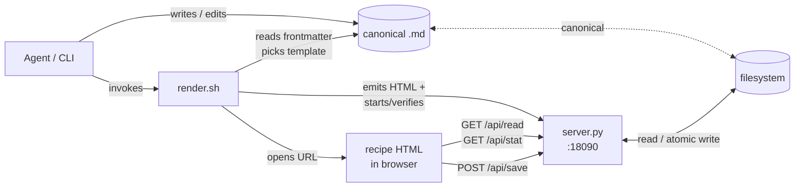
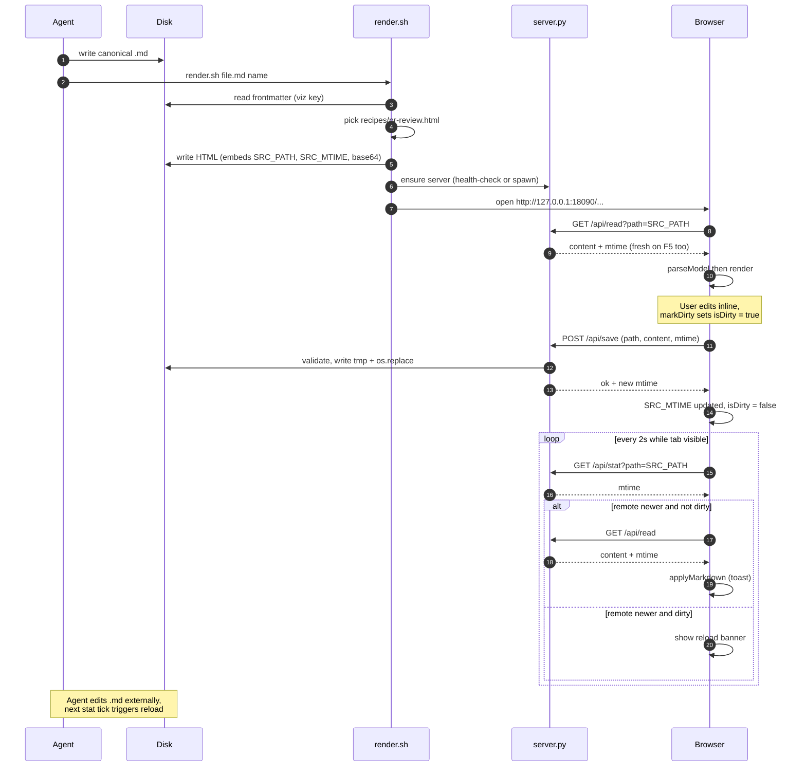
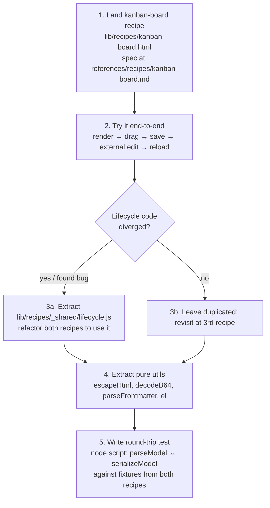

# Recipes — Architecture & Second-Recipe Plan

## Why this doc

Today only one recipe exists (`pr-review`). One sample is not enough to know
whether the recipe abstraction is shaped right. Before writing a round-trip
test, we add a second recipe with a structurally different layout, and use
the diff to decide what to extract into shared scaffolding vs. keep
recipe-local.

Out of scope: ship-quality polish on the second recipe. Goal is to expose
seams, not to add a second flagship.

> **Update (2026-06-07).** The second recipe that actually landed is the
> generic **`feedback`** recipe (not the `kanban-board` sketched below). It
> deliberately breaks the `parseModel`/`serializeModel`/`render` contract
> stated in this doc: the **body is rendered read-only and kept verbatim** —
> only the human's `choice`/`notes` round-trip through frontmatter. That is
> itself the seam this doc was hunting: a recipe whose payload is the author's
> prose does *not* need to pass the body through a model.
>
> This reframes the recipe layer: `feedback` is the **generic** shape
> (render any markdown → collect a structured response → write back), and
> `pr-review` is the **exception** that genuinely needs a per-domain grammar +
> full inline editing. New "human reviews a doc and answers" cases should be
> frontmatter on `feedback`, not a new recipe file. See
> `lib/recipes/feedback.{html,model.js}` and
> `skills/viz-render/references/recipes/feedback.md`.
>
> Deliberately **not** done (per the Non-goals below, still in force): no
> control-DSL / form-builder and no lifecycle-framework extraction — only one
> use case (choice + text) exists and no shared lifecycle *bug* was found,
> just drift. Revisit only when a real second feedback shape appears.
> `kanban-board` remains an unbuilt sketch.

## Current architecture



Layers and responsibilities today:

| Layer | File | Responsibility | Recipe-aware? |
|---|---|---|---|
| Dispatcher | `lib/render.sh` | Read `viz: <recipe>` frontmatter, swap template, run server | Yes (only switches template path) |
| HTTP | `lib/server.py` | Serve `/tmp/viz`, `/api/health`, `/api/stat`, `/api/read`, `/api/save` | No — generic for any `.md` |
| Generic viewer | `lib/template.html` | Markdown → styled HTML, no save | No |
| Recipe template | `lib/recipes/<name>.html` | Parse markdown → model → interactive UI → serialize back | Yes — hand-written per recipe |
| Spec | `skills/viz-render/references/recipes/<name>.md` | Markdown shape contract for agents | Yes |

`lib/recipes/pr-review.html` (671 lines) bundles four concerns:

1. **Markdown grammar** (recipe-specific): `parseModel`, `serializeModel`,
   `parseFrontmatter`.
2. **Render** (recipe-specific): DOM construction, severity colors,
   inline-edit wiring.
3. **Lifecycle** (generic): `applyMarkdown`, `fetchAndApply`, `checkRemote`,
   `saveToServer`, banner/toast UI, `withModel` guard, polling setup.
4. **Boot** (generic): initial-load decision tree (`/api/read` → fallback to
   embedded base64), button wiring.

Concerns 3+4 will repeat verbatim in every recipe. That is the seam we want
to validate, not refactor speculatively.

## Round-trip & live-reload sequence



## What a recipe must provide (contract)

Every recipe HTML is a self-contained file under `lib/recipes/<name>.html`
with these placeholders filled by `render.sh`:

- `DOC_BASE64_PLACEHOLDER` — initial markdown bytes (fallback only)
- `DOC_NAME_PLACEHOLDER` — output basename (for downloads)
- `SOURCE_PATH_PLACEHOLDER` — absolute path of the source `.md`
- `SOURCE_MTIME_PLACEHOLDER` — mtime at render time

Inside, every recipe must implement:

- `parseModel(md) → model` — markdown → in-memory shape
- `serializeModel(model) → md` — round-trippable inverse
- `render(model) → DOM mutation` — paint the UI, wire `markDirty()` on edits

Everything else (toast, banner, polling, save/export buttons, withModel
guard, initial-load decision) is **identical scaffolding** that we currently
copy. The second recipe will tell us whether it is truly identical or merely
similar.

## Proposed second recipe: `kanban-board`

Why kanban:

- **Layout differs structurally**: columns (status) vs `pr-review`'s stacked
  severity sections. Forces `render` to be genuinely recipe-local rather
  than "the pr-review layout with a different stylesheet".
- **Grouping key is mutable in UI**: dragging a card changes its column,
  i.e. its grouping key. In `pr-review`, severity is fixed and only
  `status` cycles. This stresses the model: `markDirty` must fire on
  reordering, not just field edits.
- **Per-item structure stays simple**: title + a few meta fields. Keeps the
  recipe small enough to land in one pass.

### Markdown shape

```markdown
---
viz: kanban-board
title: Sprint 12
---

# Notes

<optional free prose, like pr-review's # Summary>

## Todo

### Wire OAuth callback
- owner: nick
- estimate: 2d
- tag: auth

### Add audit log table
- owner: -
- estimate: 1d

## In Progress

### Migrate to httpOnly cookies
- owner: nick
- estimate: 3d
- tag: auth

## Done

### Spike: pick OAuth provider
- owner: nick
- estimate: 0.5d
```

Rules mirror `pr-review`:

- `## <Column>` → kanban column. Order in markdown = order in UI (left→right).
- `### <Title>` under a column → card.
- `- key: value` bullets → meta strip on the card.
- No `status:` key — column membership *is* the status.

### UI behaviors

- Render columns left-to-right; cards stacked top-to-bottom.
- Drag card between columns → updates `model` (move finding from one
  section's `findings` array to another), `markDirty()`.
- Drag within a column to reorder.
- Title and meta values inline-editable, same as pr-review.
- Save / Export / Download work the same.

### What must change vs pr-review

| Concern | pr-review | kanban-board |
|---|---|---|
| Layout | stacked vertical groups | horizontal columns |
| Status | per-card field that cycles | column membership |
| Reorder | none | drag within / across columns |
| Filters | by severity | (omit for v1) |
| Color rules | severity-based stripe | per-column header color |
| `parseModel` shape | `sections[].findings[].meta` | `columns[].cards[].meta` (alias) |

If `columns[].cards[].meta` is just renamed `sections[].findings[].meta`,
that is itself a finding: the model shape is generic. We may rename the
internal type in pr-review later, or keep recipe-local names and accept the
duplication.

## What we expect to learn

After landing kanban-board, decide:

1. **Lifecycle code** (`fetchAndApply`, `checkRemote`, `saveToServer`,
   banner, toast, polling, `withModel`, initial-load decision) — extract to
   `lib/recipes/_shared/lifecycle.js` and `<script src=…>` it from each
   recipe? Or keep copy-pasted and accept ~150 LOC of dup per recipe?
   Decision criterion: did we discover ≥1 lifecycle bug while building
   kanban that pr-review also had? If yes, extract. If no, leave alone.

2. **`el()` DOM helper, `escapeHtml`, `parseFrontmatter`, `decodeB64`** —
   pure utilities, no lifecycle coupling. Cheap to extract; do it
   regardless once we have the second copy.

3. **Boot template** — every recipe ends up with the same `window.onload`
   block. Consider a tiny `bootRecipe({parseModel, serializeModel, render})`
   wrapper that hides the boilerplate. Defer until 3rd recipe — premature
   with two.

4. **Spec template** — `skills/viz-render/references/recipes/<name>.md` has
   a near-identical structure (Trigger / Markdown structure / Rules /
   Bidirectional flow / Round-trip preservation / Example). Worth a
   `_template.md` once we see the second instance.

## Plan



Step 5 (round-trip test) is now well-shaped because we have two grammars
to test against — a single-recipe test cannot tell us whether the test
harness is recipe-agnostic.

## Non-goals

- Not refactoring `pr-review` before the second recipe lands.
- Not extracting a "recipe framework". The whole value of the
  markdown-canonical pattern is small self-contained HTML files; a
  framework would re-introduce the build step we deliberately avoided.
- Not adding cross-recipe features (recipe picker UI, etc.).

## Open questions

- Drag-and-drop across columns: native HTML5 DnD vs a tiny manual
  pointer-down/move/up handler? HTML5 DnD has well-known quirks but no
  dependency cost. Decide during implementation.
- Reorder persistence: do we expose card position within a column as a
  number in the markdown, or rely on document order alone? Document order
  is simpler and round-trips naturally — start there.
