# Mermaid Diagram Types Reference

## 1. Flowchart / Graph

**Use for**: Process flows, decision trees, algorithms, workflows

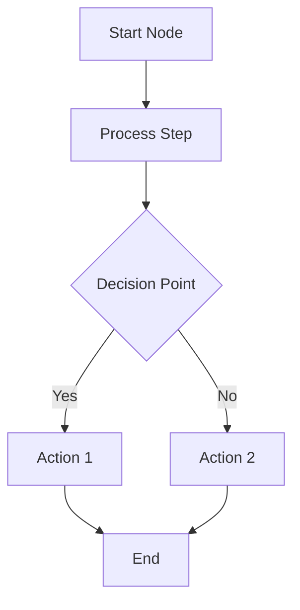

**Direction options**: `TD` (top-down), `LR` (left-right), `BT` (bottom-top), `RL` (right-left)

**Node shapes**:
- `[Rectangle]` — standard process
- `(Rounded)` — start/end points
- `{Diamond}` — decisions
- `[[Subroutine]]` — predefined process
- `[(Database)]` — data storage

### ELK layout — for tangled graphs

Dagre (the default) produces heavy edge crossings past ~12 nodes. Opt into the
ELK layered engine per diagram with a directive on the first line:

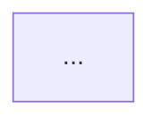

Use it whenever the graph has more than ~12 nodes or several converging edges
(an event bus, a shared database). Leave it off for small graphs — dagre is
more compact there. Other ELK algorithms: `elk.stress`, `elk.force`,
`elk.mrtree`.

**ELK flowchart + `subgraph` is the workhorse for complex architecture** —
prefer it over `architecture-beta` (below) whenever edge routing matters.

## 2. Architecture (`architecture-beta`)

**Use for**: small service maps where group boundaries and brand identity carry
the message — roughly ≤10 services and few edges.

```mermaid
architecture-beta
    group edge[Edge]
    group core[Core Platform]

    service cdn(logos:aws-cloudfront)[CDN] in edge
    service gw(logos:aws-api-gateway)[API Gateway] in edge
    service ord(logos:aws-lambda)[Orders] in core

    cdn:R -- L:gw
    gw:B -- T:ord
```

- Ports are explicit: `a:R -- L:b` leaves `a`'s right side, enters `b`'s left.
  Arrowheads use `-->` instead of `--`.
- `service id(icon)[Label] in group` — the icon is optional. The `logos:` pack
  ([icon list](https://icon-sets.iconify.design/logos/)) is registered in the
  viewer; without an icon a service renders as a plain empty box.
- **Known weakness**: its layout engine routes edges diagonally across groups
  and lets labels collide with edges. Keep the edge count low, or use an ELK
  flowchart with `subgraph` instead.

## 3. Sequence Diagram

**Use for**: API interactions, system communications, time-based flows

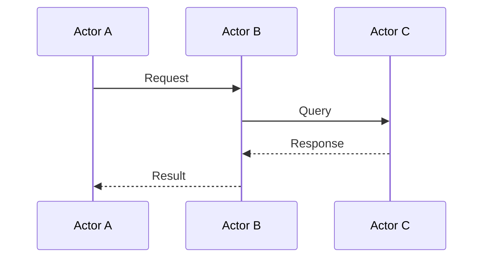

## 4. Class Diagram

**Use for**: Object-oriented design, data models, entity relationships

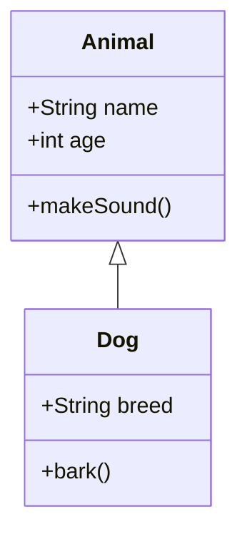

## 5. State Diagram

**Use for**: State machines, workflow states, status transitions

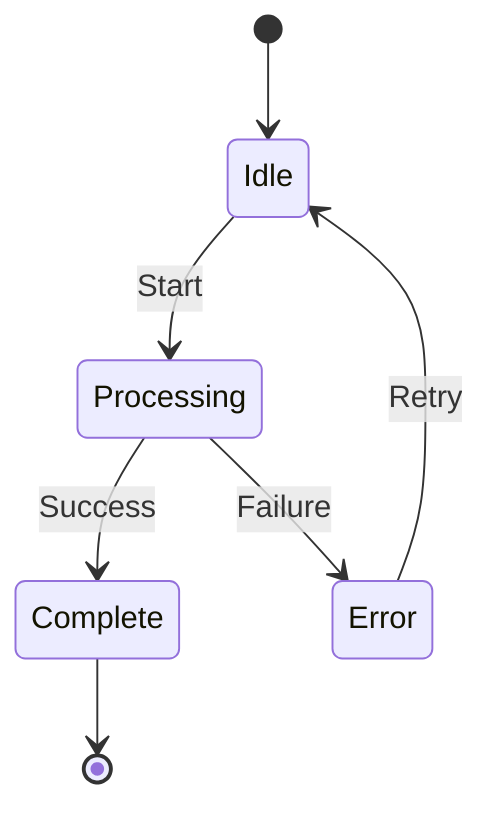

## 6. Entity Relationship Diagram

**Use for**: Database schemas, data relationships

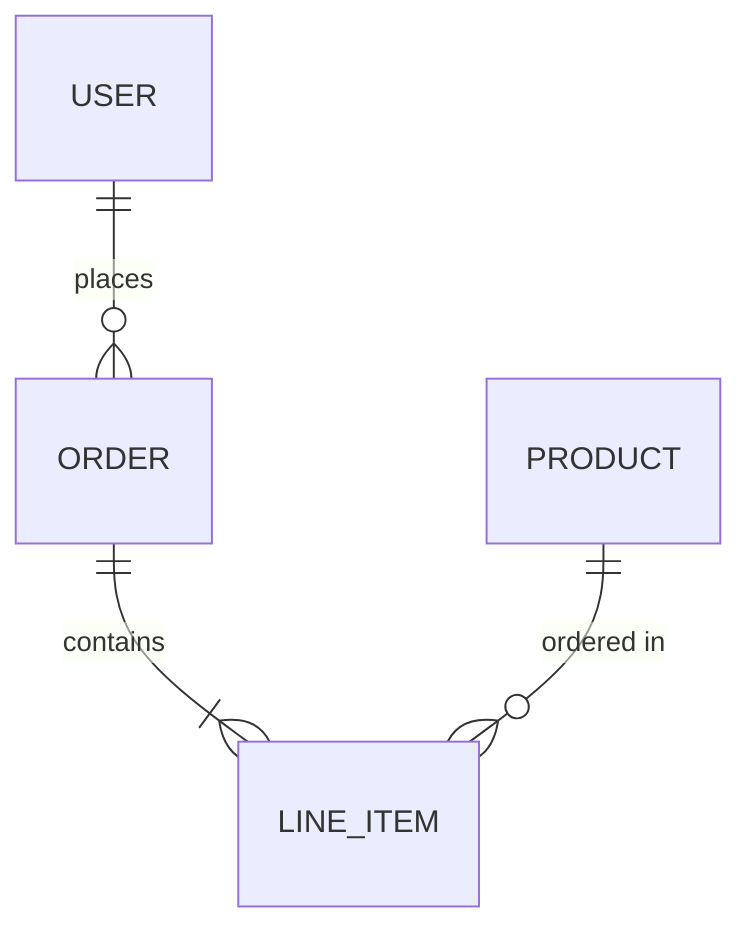

## 7. Gantt Chart

**Use for**: Project timelines, task scheduling

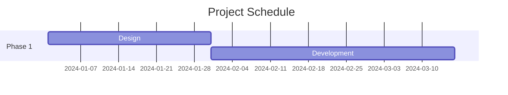

## 8. Pie Chart

**Use for**: Data distribution, proportions

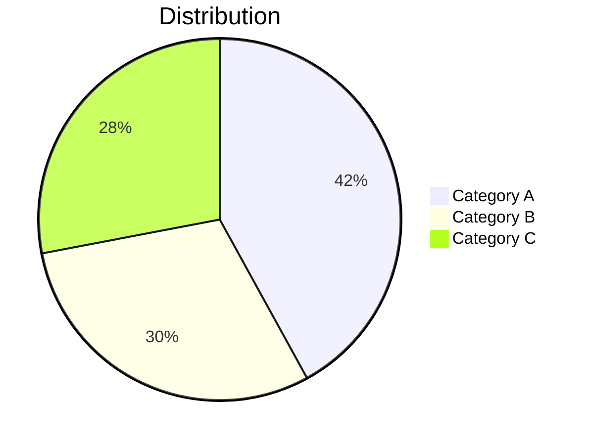

## Best Practices

**DO**:
- Use descriptive node labels (e.g., "User Authentication" not "Auth")
- Keep diagrams focused: 5-15 nodes optimal
- Use quotes for labels with spaces: `A["User Input"]`
- Use subgraphs to organize complex flowcharts
- Include meaningful arrow labels for decision branches

**DON'T**:
- Create overly complex diagrams (>20 nodes) — split into multiple, or switch to ELK layout
- Use very long text in labels (>30 chars) — breaks layout
- Use spaces in node IDs (use camelCase or underscores)
- Mix diagram types in a single chart

## Styling (Optional)

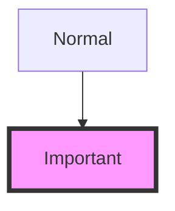

## Subgraphs

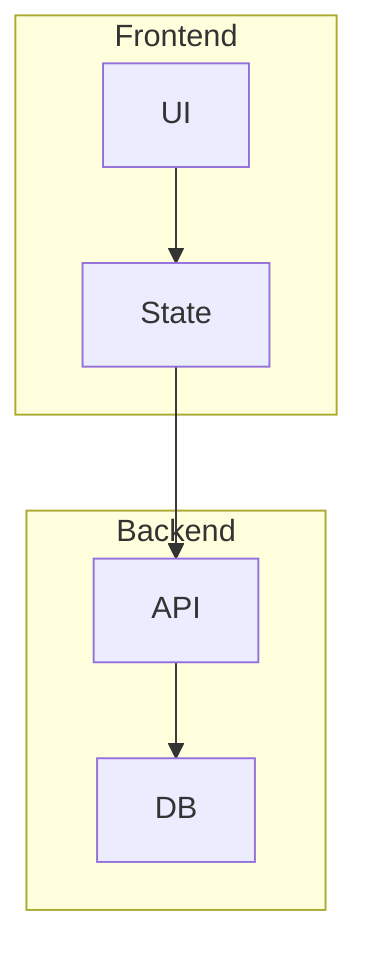
