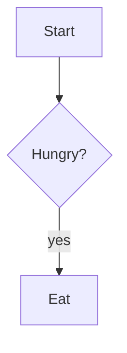

## 午餐吃什麼？

| 選項 | 好處 | 代價 | 改回成本 |
|---|---|---|---|
| 便當 | 便宜；快 | 油 | 低 |
| 拉麵 | 好吃；熱 | 要排隊；鹹 | 中 |
| 沙拉 | 清爽 | 吃不飽 | 低 |

## 流程

```mermaid
graph TD
    Start[Start] --> Decide{Hungry?}
    Decide -->|yes| Eat[Eat]
```

## 壞掉的圖

```mermaid
graph TD
    A -->
```
